# PDF → PPTX/DOCX 고충실도 문서 변환기 구현 지침서

- 문서 상태: 구현 기준선 · 현재 저장소 재검토 완료
- 작성일: 2026-08-03
- 최종 재검토일: 2026-08-03
- 대상 저장소: KC DeepL macOS 앱
- 대상 구현자: GPT Luna 또는 동등한 구현 에이전트
- 우선순위: 이 기능에 대해서는 본 문서가 기존 `technical_spec.md`와 `execution_plan.md`보다 우선한다.

## 0. 재검토 결론과 현재 저장소 기준선

이 지침서는 아래의 현실적인 품질 계약을 전제로 하면 구현을 시작하기에 충분하다. 다만 “임의 PDF의 모든 작성 의미를 되살리면서 픽셀까지 완전히 동일”하다는 불가능한 약속으로 읽어서는 안 된다. Office가 동등하게 표현하는 객체는 네이티브화하고, 동등성이 증명되지 않는 합성은 최소 render island 또는 명시적 page fallback으로 보존하며, 모든 판단을 보고서와 gate로 검증하는 것이 완료 조건이다.

2026-08-03에 실제 저장소와 로컬 산출물을 다시 확인한 기준선은 다음과 같다. Luna는 구현 시작 직전에 같은 항목을 다시 검사하고, 이 snapshot보다 실제 코드가 우선한다.

| 확인 항목 | 현재 기준선 | 구현 시 계약 |
| --- | --- | --- |
| 빌드 구조 | SwiftPM, macOS 14+, `KCDeepL` executable과 `KCDeepLCore` library | 기존 product와 Finder 중복 파일 제외 로직을 보존하고 변환 module/worker만 추가 |
| 상태 소유권 | `KCDeepLApp`이 `FileTranslationViewModel`을 `@StateObject`로 소유하고 `ContentView`를 통해 workspace에 주입 | `DocumentConversionViewModel`도 같은 app-scoped 주입 패턴 사용 |
| 파일번역 UI | `FileTranslationWorkspace`의 고정 `HSplitView` 오른쪽 `inspectorPane`에 `engineSettings`가 있음 | root/split 구조를 교체하지 않고 바로 위에 변환 섹션 삽입 |
| 종료 처리 | `AppDelegate.applicationShouldTerminate`가 `PendingPersistenceRegistry.flushAll()`을 기다림 | 변환 취소와 worker/temp drain도 같은 registry에 등록 |
| 권한 | main app entitlement는 현재 audio input뿐이며 App Sandbox는 꺼져 있음 | main entitlement를 임의 확대하지 않고 PDF worker만 독립 최소 sandbox로 검증 |
| 패키징 | `script/build_and_run.sh`는 현재 host architecture 한 번만 빌드하고 서명에 `--deep`을 사용 | release 경로를 dual-architecture, nested-first explicit signing, outer-last signing으로 교체 |
| 기존 `.app` | `dist/`와 `application/`의 확인 가능한 bundle은 현재 x86_64 thin이며 strict signature 검증을 release 증거로 쓸 수 없음 | 사용자 소유 산출물을 수정하지 말고 새 staging/export artifact에서 다시 증명 |

현재 앱은 SwiftUI가 화면·상태의 source of truth이고 AppKit은 `NSSavePanel`, `NSWorkspace`, app lifecycle 같은 좁은 경계에만 사용한다. 새 기능도 이 경계를 유지한다. SwiftPM executable build가 `.app` bundle이나 helper embedding을 자동으로 해 준다고 가정하지 않으며, 실제 staging bundle을 검사하지 않은 상태에서 universal, sandboxed, signed, notarization-ready라고 보고하지 않는다.

## 1. 먼저 고정해야 할 결론

### 1.1 “완벽한 변환”의 기술적 의미

임의의 PDF를 픽셀 단위로 완전히 동일하게 보존하면서 동시에 모든 내용을 PowerPoint/Word의 네이티브 편집 객체로 되살리는 범용 변환은 불가능하다. PDF는 원본 문서의 문단, 차트 데이터, SmartArt, 슬라이드 마스터 같은 작성 의미를 반드시 보존하지 않고, 최종 화면을 만드는 그래픽 명령만 보존할 수 있기 때문이다. PDF의 soft mask, transparency group, knockout/isolation, 비정상 blend mode, DeviceN/spot color, overprint, 임의 clipping, mesh shading에도 Office DrawingML의 일대일 대응물이 없다.

따라서 이 프로젝트에서 “완벽”은 다음 계약으로 정의한다.

1. 원본에서 실제로 그려진 텍스트, 이미지, 벡터, 마스크, 클립, 투명도, 레이어 순서를 빠짐없이 인벤토리화한다.
2. Office가 시각적으로 동등하게 표현할 수 있는 항목만 네이티브 편집 객체로 만든다.
3. 동등 표현이 불가능한 항목은 전체 페이지가 아니라 의존 관계가 있는 최소 영역을 alpha-capable RGBA 렌더 섬으로 합성한다. Backdrop-independent이면 투명도를 유지하고, page backdrop 의존이면 안전성이 증명된 opaque island 또는 명시적 page fallback을 사용한다.
4. 어떤 객체도 조용히 누락하거나 흰 배경으로 평면화하지 않는다.
5. 글꼴 대체, OCR, outline/raster fallback, 템플릿 추론, 페이지 크기 보정은 모두 품질 보고서와 UI 경고에 남긴다.
6. 출시 앱에서는 target plan을 자체 preview compositor로 렌더해 원본과 비교하고, scene coverage와 package 구조를 검증한다. 설치된 macOS Office로 실제 OOXML 결과를 재렌더하는 검사는 개발/release corpus gate로 분리한다.
7. Release corpus에서 기준을 통과하지 못한 converter build는 배포하지 않는다. 개별 사용자 문서에서 자체 검증을 통과하지 못하면 자동 보정·렌더 섬 확대 후에도 성공으로 위장하지 않고 해당 페이지와 이유를 명시한다.

핵심 원칙은 다음 한 문장이다.

> 원본 PDF 렌더러가 시각적 진실의 기준이며, 검증된 경우에만 네이티브 Office 객체를 허용한다.

### 1.2 이 저장소에 채택할 기술 구성

| 영역 | 채택 기술 | 이유 |
| --- | --- | --- |
| PDF 객체·텍스트·이미지 추출 | 앱에 포함한 native Swift PDF worker + 고정 버전 PDFium 공개 C API | C parser crash/hang을 메인 앱에서 격리하면서 문자 좌표·페이지 객체·Form/path/image API 사용 |
| 그래픽 상태 보완 | Core Graphics `CGPDFScanner` | content stream의 연산 순서, ExtGState, SMask, blend, clipping, marked content를 보완 |
| 기준 렌더와 render island | PDFium renderer | 추출기와 같은 PDF 해석기를 기준으로 사용하고 객체 활성 상태를 제어해 최소 영역 렌더 |
| OCR | 기존 Apple Vision accurate recognition | 로컬 처리, 현재 앱과 배포 모델에 부합 |
| 글꼴 검색·측정 | CoreText | macOS 설치 글꼴, glyph coverage, 줄·박스 fit 측정 |
| 이미지·색 관리 | CoreGraphics, ImageIO, ColorSync | RGBA PNG, ICC/CMYK → sRGB, premultiplied alpha 처리 |
| 중간 표현 | 버전이 있는 `PDFSceneDocument` JSON manifest + 외부 asset 폴더 | 추출과 Office 생성을 분리하고 디버깅·회귀 테스트 가능 |
| OPC ZIP 생성 | ZIPFoundation을 고정 버전 SwiftPM dependency로 사용 | Apple 플랫폼에서 순수 Swift로 ZIP entry를 streaming 작성하고 취소·메모리 사용을 제어 |
| PPTX/DOCX 생성 | 순수 Swift `PresentationMLWriter`·`WordprocessingMLWriter` | 외부 런타임 없이 OPC/OOXML part, relationship, DrawingML을 직접 생성 |
| XML 작성·검사 | Foundation XML parser + namespace-safe `XMLStreamWriter` + typed builders | 문자열 보간으로 XML을 조립하지 않고 escape, namespace, ID, relationship 무결성을 강제 |
| 앱 통합 | 별도 `DocumentConversionViewModel` | 기존 번역 상태와 회귀를 분리 |

PDFium은 같은 macOS platform용 `arm64`와 `x86_64` complete static library를 만든 뒤 하나의 universal `libpdfium.a`로 결합하고, public C headers와 함께 `PDFium.xcframework`에 넣는다. SwiftPM의 local `binaryTarget`으로 연결하고 앱에 서명해 포함하는 universal `KCDeepLPDFWorker` Swift executable에 정적으로 링크한다. 사용자는 `.dylib`, DLL, 별도 runtime 또는 외부 converter를 설치하지 않는다. `main`을 따라가지 않고 정확한 upstream commit을 고정하고, 사용한 commit, 빌드 인자, architecture별 archive와 universal archive/XCFramework의 SHA-256, 포함 라이선스를 `Vendor/PDFium/manifest.json`과 `THIRD_PARTY_NOTICES.md`에 기록한다. 실험적 PDFium API를 쓰는 만큼 고정 버전 golden test를 릴리스 게이트로 삼는다.

ZIPFoundation은 `Package.swift`에 SwiftPM source dependency로 추가하고 `Package.resolved`에서 검증한 exact revision/version을 고정한다. 버전 범위만 둔 채 릴리스하지 않는다. Writer는 OOXML 표준의 필요한 subset을 typed Swift API로 소유하며, PowerPoint/Word 설치 여부와 무관하게 변환한다.

이 기능의 **출시 런타임 경계는 macOS native Swift**로 고정한다.

- 허용: Swift/SwiftPM, Apple frameworks, 정적 PDFium XCFramework, ZIPFoundation source package, 앱 bundle 안에 nested-signing되는 native universal Swift PDF worker.
- 금지: .NET runtime, `DocumentFormat.OpenXml` DLL, Windows COM, PowerPoint/Word automation을 변환 필수 경로로 사용, Python/Java/LibreOffice 설치 의존, 임의 shell converter.
- Microsoft Open XML SDK는 OOXML 동작을 확인하는 **개발용 참고 구현 또는 선택적 CI 교차검사기**로만 사용할 수 있다. 앱에 포함하거나 최종 사용자에게 설치를 요구해서는 안 된다.
- macOS PowerPoint/Word가 설치된 개발 장비에서는 결과를 다시 열고 export하는 release QA를 수행할 수 있지만, 이것 역시 변환기의 런타임 의존성이 아니다.

### 1.3 선택하지 않은 접근

| 접근 | 사용하지 않는 이유 |
| --- | --- |
| PDF 페이지 전체를 PNG로 넣기 | 시각 보존은 쉽지만 텍스트·도형 편집성과 템플릿 분리가 사라짐 |
| PDFKit만 사용 | 현재 코드가 텍스트·OCR에는 유용하지만 image XObject, path, mask, blend, 정확한 paint order 모델이 부족함 |
| `python-pptx` / `python-docx` | Python runtime 배포가 현재 Swift 앱과 맞지 않고 master, floating Word shape, 고급 DrawingML 지원이 부족함 |
| LibreOffice headless 변환 | 외부 설치 상태와 버전에 의존하며 mask/template 정책을 제어할 수 없음 |
| .NET/Open XML SDK helper | DLL과 별도 런타임·architecture별 helper를 배포해야 하며 macOS native Swift 제품 경계에 맞지 않음. SDK는 개발 참고에만 사용 |
| PowerPoint/Word 자동화로 생성 | Office 설치·권한·버전에 의존하고 headless/CI 재현성이 낮으므로 변환 필수 경로로 사용할 수 없음 |
| Adobe PDF Services 기본 경로 | cloud upload·서버 credential·과금이 필요하고 내부 template/render-island 정책을 제어할 수 없음 |
| Aspose/Apryse 결과를 그대로 사용 | 빠른 상용 baseline에는 유용하지만 본 요구사항 전체와 템플릿 분류를 보장하지 않음 |
| MuPDF/PyMuPDF 무단 포함 | AGPL 또는 상용 라이선스가 필요함. 프로세스를 분리해도 라이선스 우회가 되지 않음 |

상용 MuPDF 계약을 체결한 경우에는 `fz_device`가 path, text, image mask, mask/group/tile 이벤트를 직접 제공하므로 `PDFSceneExtracting`의 고급 backend로 추가할 가치가 있다. 그러나 계약 전에는 구현·배포 기본값으로 사용하지 않는다.

## 2. 요구사항 추적표

| 사용자 요구사항 | 구현 규칙 | 검증 기준 |
| --- | --- | --- |
| PDF 한 페이지씩 PPTX/DOCX로 변환 | PDF page → PPT slide 또는 Word section/page | 페이지 수와 순서 100% 일치 |
| 모든 이미지 추출 | 실제 paint occurrence마다 수집하고 원본 asset과 배치 정보를 분리 | 보이는 image occurrence 누락 0 |
| 투명도·SMask·마스크 보존 | 단순 alpha는 PNG/shape alpha, 복합 mask는 투명 render island | 검정·흰색·색 배경 합성 diff 허용 오차 이하 |
| 배경·워터마크·머리글·꼬리글 템플릿화 | 반복 fingerprint와 z-order 안전성으로 master/header/footer 분류 | template precision 0.98 이상, 오탐 시 승격 금지 |
| PDF의 여러 시각적 줄을 한 글상자로 병합 | glyph → word → line → paragraph → text box 계층화 | 문단별 textbox, 줄별 textbox 금지 |
| 다이어그램·선·도형을 네이티브화 | preset geometry/connector/table/custom geometry 순으로 복원 | 독립 labeled eligible primitive fixture의 native 변환 100%, false-positive 0 |
| 반투명 색·레이어 순서 보존 | 원본 paint order를 단일 정수로 유지하고 target z-order로 직렬화 | 겹침 fixture에서 순서 오류 0 |
| 글 위치·페이지 좌표 보존 | double PDF point를 유지하고 마지막에만 EMU 변환 | text bbox 중앙값 오차 0.5pt 이하 |
| 편집 가능성과 시각 충실도 동시 확보 | native-first + 최소 render island | 페이지별 native 비율과 island 면적 보고 |
| 저장 | 임시 파일 작성 → 검증 → 원자적 move, 원본/기존 출력 비덮어쓰기 | 실패·취소 시 부분 출력 0 |

## 3. 제품 동작과 UI 계약

### 3.1 정확한 UI 위치

현재 오른쪽 inspector는 [`FileTranslationWorkspace.swift`](../Sources/App/Views/FileTranslationWorkspace.swift)의 `inspectorPane` 안에서 `engineSettings`를 표시한다. 기존 `HSplitView`, preview, toolbar, 번역 섹션을 재작성하지 말고 다음 순서로 새 `DocumentConversionSection`을 삽입한다. SwiftUI가 picker/progress/state를 소유하고 AppKit은 저장 패널과 결과 열기라는 좁은 edge만 담당한다.

```swift
documentConversionSettings
    // 번역 중에는 섹션을 막지만 변환 중인 자기 취소 버튼은 살린다.
    .disabled(fileTranslationViewModel.isBusy)

engineSettings
    .disabled(isAnyFileOperationBusy)

outputSettings
    .disabled(isAnyFileOperationBusy)
```

UI 표기는 다음과 같이 고정한다.

```text
문서 변환
[ 파워포인트 (.pptx)  ▾ ]
[ 변환 시작 ]
PDF의 편집 가능한 텍스트·도형을 복원하고,
복합 효과는 투명 이미지로 보존합니다.

번역 엔진
...
```

- picker 값: `파워포인트 (.pptx)`, `워드 (.docx)`
- 기본값: `파워포인트 (.pptx)`
- 버튼: `변환 시작`
- 실행 중 버튼: `변환 취소`
- 완료 후: `변환 문서 열기`, `Finder에서 보기`, `품질 보고서 보기`
- TXT/Markdown 선택 시 섹션을 숨기지 말고 비활성화하면서 `PDF에서만 사용할 수 있습니다.`를 표시한다.
- PDF에 번역 가능한 텍스트가 0개여도 변환 버튼은 활성화할 수 있다.
- 번역 엔진과 언어 선택은 문서 변환에 영향을 주지 않는다.
- 상단 toolbar의 번역 엔진 picker에는 `번역 엔진` help/label을 유지해 변환 형식과 혼동되지 않게 한다.
- `Picker`의 시각 label을 숨겨도 accessibility label/value는 `변환 형식`과 현재 형식으로 제공한다. 시작/취소/완료 버튼, 진행률, 오류에는 VoiceOver label/help를 제공하고 full-keyboard-access의 Tab/Space 조작을 막는 custom gesture를 쓰지 않는다.
- 기존 `⌘O` 파일 선택 단축키와 번역 action을 유지한다. 새 전역 keyboard shortcut은 기존 command와 충돌 검사를 통과하기 전에는 추가하지 않는다.
- 변환 섹션 구현이 커지면 독립 `DocumentConversionSection` SwiftUI subview로 분리하되 ViewModel을 새로 생성하거나 AppKit 객체를 장기 보관하지 않는다.

화면 공통 busy projection은 단순히 두 버튼만 막는 것이 아니다.

```swift
let isAnyFileOperationBusy = fileTranslationViewModel.isBusy
    || documentConversionViewModel.isBusy
```

- `fileToolbar`, file importer trigger, drop destination, 문서 닫기/교체, 번역 engine/output setting, 번역 시작, 변환 format/start를 이 값으로 일관되게 제어한다. 단, 실행 중인 작업의 취소 control을 포함한 상위 container 전체에 `.disabled(isAnyFileOperationBusy)`를 걸지 않는다.
- 번역 중에는 변환 시작이, 변환 중에는 번역 시작이 비활성이다. 현재 실행 중인 작업의 **취소 버튼만** 계속 활성이다.
- 이미 열린 importer의 늦은 completion, 외부 URL/drop, source 재분석 callback이 들어와도 operation generation/source version 검사를 다시 해 실행 중 job을 다른 파일의 결과로 덮어쓰지 않는다.
- `.files`에서 다른 mode로 이동하는 것만으로 작업을 취소하지 않는다. 앱 범위 ViewModel이 진행 상태를 보존하며 돌아왔을 때 같은 progress/output을 표시한다.

| control | idle/ready | 번역 중 | 변환 중 |
| --- | --- | --- | --- |
| 파일 선택·drop·닫기 | 활성 | 비활성 | 비활성 |
| 변환 format picker/start | 활성 조건 계산 | 비활성 | picker/start 숨김 또는 비활성 |
| 변환 cancel | 없음 | 없음 | **활성** |
| 번역 settings/start | 기존 조건 계산 | start 대신 진행/cancel | 비활성 |
| 번역 cancel | 없음 | **활성** | 없음 |
| 결과 open/reveal/report | 결과가 있을 때 활성 | 기존 결과는 열 수 있으나 source mutation 금지 | 기존 결과는 열 수 있으나 source mutation 금지 |

UI disable만으로 상호 배제를 보장하지 않는다. `KCDeepLApp` composition root에서 하나의 `@MainActor FileWorkspaceOperationGate`를 만들고 `FileTranslationViewModel`과 `DocumentConversionViewModel`에 동일 인스턴스를 주입한다. Gate는 `analysisOrTranslation`과 `conversion` 종류, 불투명 operation ID, source selection generation을 가진 lease를 원자적으로 발급한다. 모든 public start/import 진입점은 작업 전에 lease를 얻어야 하며, 이미 다른 종류가 활성이라면 호출 순서나 같은 run-loop click과 관계없이 사용자 표시 가능한 busy 오류로 거부한다. 성공·오류·취소·worker crash·stale generation의 모든 terminal path에서 **자신의 ID와 일치하는 lease만** 한 번 해제한다. `isAnyFileOperationBusy`는 이 실제 gate/VM 상태의 UI projection이지 배제의 유일한 장치가 아니다.

새 source 선택은 현재 변환에 cancellation을 요청하고 gate lease가 종료된 뒤에만 새 analysis lease를 얻는다. 분석과 번역을 하나의 무제한 동시 작업으로 만들지 말고 현재 `FileTranslationViewModel`의 직렬 lifecycle을 보존한다. 두 ViewModel의 start 메서드를 같은 actor turn에서 직접 연속 호출하는 테스트로 동시 실행이 절대 생기지 않음을 증명한다.

### 3.2 파일과 저장 규칙

- PowerPoint: `<원본파일명>.converted.pptx`
- Word: `<원본파일명>.converted.docx`
- 충돌 시 기존 resolver와 동일하게 ` (2)`, ` (3)`을 붙인다.
- 원본 PDF와 기존 파일은 절대 덮어쓰지 않는다.
- 별도 저장 위치 picker를 만들지 않고 현재 file workspace의 `downloadLocation`(`데스크탑`, `다운로드`, `매번 묻기`)을 번역과 공유하되 출력 resolver는 형식별로 분리한다.
- `매번 묻기`에서는 다음 UTI를 사용한다.
  - PPTX: `org.openxmlformats.presentationml.presentation`
  - DOCX: `org.openxmlformats.wordprocessingml.document`
- 품질 보고서는 `Application Support/KCDeepL/ConversionReports/<source-sha256>-<timestamp>.json`에 저장하고 결과 UI에서 연다. 사용자의 출력 폴더에는 Office 문서 하나만 만든다.

`NSSavePanel`은 현재 `FileTranslationPanel`처럼 `@MainActor`의 작은 panel service에서만 생성한다. 변환 resolver/panel은 기존 번역 resolver의 `.pdf/.txt/.md` 의미를 바꾸지 않는 별도 타입으로 둔다. `UTType(filenameExtension:)`을 우선 사용하고 위 identifier를 검증된 fallback으로 사용하며, `allowedContentTypes`, `isExtensionHidden=false`, `canCreateDirectories=true`, 추천 파일명을 형식별로 설정한다. Panel 취소는 오류가 아니라 아무 작업도 시작하지 않은 상태다.

현재 main app은 비-sandbox지만 file importer/drop에서 받은 source URL에는 `startAccessingSecurityScopedResource()`를 호출한 범위에서 read-only descriptor를 열고, descriptor 수명과 security-scope 종료 순서를 명시한다. Save panel이 준 destination도 향후 main sandbox 전환을 고려해 output commit이 끝날 때까지 필요한 security scope를 유지한다. `startAccessing...`이 `false`여도 일반 filesystem 권한으로 접근 가능한 현재 비-sandbox URL은 정상 경로다. 장기 bookmark는 앱 재실행 후 자동 재개 요구가 생기기 전에는 저장하지 않으며, broad Documents/Downloads entitlement를 추가해 우회하지 않는다.

### 3.3 진행 상태

`DocumentConversionStage`는 다음 상태를 가진다.

```text
idle
preflighting
extracting(page, total)
analyzingText(page, total)
classifyingTemplates
planningFallbacks
writing(format)
validating
completed
cancelled
failed
```

진행률 가중치는 preflight 5%, scene extraction 40%, semantic/template 분석 20%, fallback 계획 10%, OOXML 작성 15%, 검증 10%로 시작한다. 실제 계측 후 조정할 수 있지만 단계가 역행해서는 안 된다.

번역과 변환은 동시에 실행하지 않는다. `fileTranslationViewModel.isBusy || documentConversionViewModel.isBusy`를 화면 표시용 공통 busy 상태로 사용하되 실제 상호 배제는 section 3.1의 shared `FileWorkspaceOperationGate` lease가 담당한다. 새 파일을 선택하면 진행 중 변환을 취소·회수하고 generation이 다른 늦은 결과를 폐기한다.

## 4. 전체 아키텍처

```mermaid
flowchart LR
    A["선택한 PDF bytes"] --> B["Conversion preflight"]
    B --> W["Sandboxed native Swift PDF worker"]
    W --> C["PDFium page objects/text/renderer"]
    W --> D["CGPDFScanner graphics-state trace"]
    C --> E["PDFSceneDocument"]
    D --> E
    E --> F["Text semantic reconstruction"]
    E --> G["Template classifier"]
    F --> H["Target capability planner"]
    G --> H
    H --> I["Native Office nodes"]
    H --> J["Minimal RGBA render islands"]
    I --> P["Native target-plan preview compositor"]
    J --> P
    P -->|불일치| H
    I --> K["Versioned JSON + assets"]
    J --> K
    K --> L["Pure Swift OOXML writers"]
    L --> M["OPC/package structural validator"]
    M -->|runtime 통과| O["Atomic output commit"]
    M -.-> N["QA-only macOS Office round-trip verifier"]
    N -.->|corpus 불일치| H
    X["Host watchdog"] -->|timeout/cancel: exact child PID 종료| W
```



PDF에서 곧바로 OOXML을 쓰지 않는다. `PDFSceneDocument`가 extractor, semantic analyzer, fallback planner, PPTX writer, DOCX writer 사이의 유일한 계약이다. Target writer가 PDF 파일을 다시 열어 해석해서는 안 된다.

실선은 shipping app이 Office 설치 없이 매 작업에서 실행하는 경로이고 점선은 opt-in 개발/release QA 경로다. PDF 파싱·PDF reference/render-island 생성은 앱 bundle의 고정 경로에 들어 있는 서명된 universal Swift helper app `Contents/Helpers/KCDeepLPDFWorker.app/Contents/MacOS/KCDeepLPDFWorker` 안에서만 수행한다. 워커는 PDFium을 정적으로 링크하며 외부 설치물이나 shell converter가 아니다. 메인 앱은 scene 분석, target planning, OOXML 작성과 검증을 맡으므로 손상 PDF가 워커를 crash/hang시켜도 사용자 UI와 다른 작업의 프로세스는 살아 있어야 한다.

`Native target-plan preview compositor`는 writer와 같은 geometry, text metrics, image crop/alpha, z-order 결정을 CoreGraphics로 그려 planner의 손실을 잡지만 PowerPoint/Word layout engine을 흉내 냈다고 주장하지 않는다. 실제 Office round-trip은 converter version과 golden/real-world corpus를 인증하는 release gate이며 개별 사용자 output commit의 런타임 전제 조건이 아니다.

### 4.1 모듈 경계

```text
Sources/DocumentModel/
  PDFSceneDocument.swift
  PDFSceneNode.swift
  DocumentConversionReport.swift
  PDFWorkerProtocol.swift

Sources/DocumentConversion/
  WorkerClient/
    NativePDFWorkerClient.swift
    NativeChildProcess.swift
    PDFWorkerLifecycleController.swift
  Semantics/
    PDFTextReconstructor.swift
    PDFReadingOrderResolver.swift
    PDFVectorRecognizer.swift
    DocumentTemplateClassifier.swift
  Planning/
    OfficeCapabilityPlanner.swift
    RasterIslandPlanner.swift
  OOXML/
    OPCPackageWriter.swift
    OOXMLPartStore.swift
    ContentTypeRegistry.swift
    RelationshipGraph.swift
    MediaStore.swift
    XMLStreamWriter.swift
    SafeHyperlinkPolicy.swift
    PresentationMLWriter.swift
    PresentationPackageInventory.swift
    WordprocessingMLWriter.swift
    WordAnchorBuilder.swift
    OOXMLPackageValidator.swift
  Validation/
    SceneGraphValidator.swift
    OfficePlanPreviewRenderer.swift
    ConversionVisualValidator.swift

Sources/PDFWorkerCore/
  PDFConversionPreflightService.swift
  PDFiumRuntimeActor.swift
  PDFiumSceneExtractor.swift
  PDFGraphicsStateScanner.swift
  PDFContentStreamStateResolver.swift
  PDFReferenceRenderer.swift
  PDFImageAssetExtractor.swift
  PDFWorkerRequestHandler.swift

Sources/PDFWorker/
  KCDeepLPDFWorkerMain.swift

Configuration/PDFWorker/
  KCDeepLPDFWorker.entitlements
  Info.plist.template

Sources/App/Support/
  FileWorkspaceOperationGate.swift
  SelectedFileSnapshot.swift
  DocumentConversionViewModel.swift
  DocumentConversionOutputURLResolver.swift

Sources/App/Views/
  DocumentConversionSection.swift

Tests/KCDeepLDocumentConversionTests/
Tests/KCDeepLPDFWorkerCoreTests/
Tests/KCDeepLAppTests/
Tests/Fixtures/DocumentConversion/
```

`Package.swift`에 공용 wire/scene value를 담은 `KCDeepLDocumentModel`, host-side `KCDeepLDocumentConversion`, PDF parser가 들어 있는 `KCDeepLPDFWorkerCore`, 얇은 executable `KCDeepLPDFWorker`와 각각의 test target을 추가한다. 앱 target은 `KCDeepLDocumentConversion`만 의존하며 `CPDFiumBridge`, `PDFium`, `KCDeepLPDFWorkerCore`를 의존해서는 안 된다. 이 target graph가 PDFium을 메인 executable에서 물리적으로 분리하는 첫 번째 검증 대상이다.

`PDFium.xcframework`는 local `binaryTarget`으로 선언하고, 별도 C target `CPDFiumBridge`가 공개 C API를 Swift 친화적인 소유권 경계로 감싼다. Swift 코드가 PDFium 내부 C++ header에 의존해서는 안 되며 `public/` C API만 import한다. `KCDeepLPDFWorkerCore`만 `CPDFiumBridge`를 의존하고, `KCDeepLDocumentConversion`만 ZIPFoundation을 의존한다. 앱 UI target은 ZIP API와 PDFium API를 직접 사용하지 않는다.

Shipping writer는 OOXML skeleton resource를 읽지 않고 모든 required part와 relationship을 typed Swift builder로 생성한다. 이는 현재 `script/build_and_run.sh`가 앱 resource bundle 하나만 복사하는 구조에서 conversion target bundle이 누락되는 문제도 피한다. PowerPoint/Word로 만든 최소 package는 `Tests/Fixtures/DocumentConversion/`의 test-only golden으로 두어 구조 비교와 Office smoke test에만 사용하고 production output part를 복사하는 seed로 사용하지 않는다.

### 4.2 `Package.swift` 목표 형태

현재 manifest의 로컬 Finder 중복 파일 제외 로직은 보존한다. Phase 0에서 다음 목표 형태로 갱신한다. ZIPFoundation `0.9.20`은 이 지침 작성 시 검토한 기준 버전이며, 구현 시 라이선스·API·회귀를 다시 확인한 뒤 이 exact version과 `Package.resolved`를 함께 commit한다.

```swift
// swift-tools-version: 5.9

import Foundation
import PackageDescription

let packageRoot = URL(fileURLWithPath: #filePath).deletingLastPathComponent()
let localReadingFontBackup = packageRoot
    .appendingPathComponent("Sources/KCDeepLCore/ReadingFontSize 2.swift")
let coreExcludes = FileManager.default.fileExists(atPath: localReadingFontBackup.path)
    ? ["ReadingFontSize 2.swift"]
    : []

let package = Package(
    name: "KCDeepL",
    platforms: [.macOS(.v14)],
    products: [
        .executable(name: "KCDeepL", targets: ["KCDeepL"]),
        .executable(
            name: "KCDeepLPDFWorker",
            targets: ["KCDeepLPDFWorker"]
        ),
        .library(name: "KCDeepLCore", targets: ["KCDeepLCore"]),
        .library(
            name: "KCDeepLDocumentModel",
            targets: ["KCDeepLDocumentModel"]
        ),
        .library(
            name: "KCDeepLDocumentConversion",
            targets: ["KCDeepLDocumentConversion"]
        )
    ],
    dependencies: [
        .package(
            url: "https://github.com/weichsel/ZIPFoundation.git",
            exact: "0.9.20"
        )
    ],
    targets: [
        .binaryTarget(
            name: "PDFium",
            path: "Vendor/PDFium/PDFium.xcframework"
        ),
        .target(
            name: "CPDFiumBridge",
            dependencies: ["PDFium"],
            linkerSettings: [
                .linkedLibrary("c++"),
                .linkedFramework("AppKit"),
                .linkedFramework("CoreFoundation")
            ]
        ),
        .target(
            name: "KCDeepLDocumentModel",
            path: "Sources/DocumentModel"
        ),
        .target(
            name: "KCDeepLPDFWorkerCore",
            dependencies: ["CPDFiumBridge", "KCDeepLDocumentModel"],
            path: "Sources/PDFWorkerCore"
        ),
        .executableTarget(
            name: "KCDeepLPDFWorker",
            dependencies: [
                "KCDeepLPDFWorkerCore",
                "KCDeepLDocumentModel"
            ],
            path: "Sources/PDFWorker"
        ),
        .target(
            name: "KCDeepLDocumentConversion",
            dependencies: [
                "KCDeepLDocumentModel",
                .product(name: "ZIPFoundation", package: "ZIPFoundation")
            ],
            path: "Sources/DocumentConversion"
        ),
        .target(
            name: "KCDeepLCore",
            exclude: coreExcludes
        ),
        .executableTarget(
            name: "KCDeepL",
            dependencies: ["KCDeepLCore", "KCDeepLDocumentConversion"],
            path: "Sources/App",
            exclude: ["KCDeepL.entitlements"],
            resources: [.copy("Resources")]
        ),
        .testTarget(
            name: "KCDeepLCoreTests",
            dependencies: ["KCDeepLCore"]
        ),
        .testTarget(
            name: "KCDeepLDocumentConversionTests",
            dependencies: [
                "KCDeepLDocumentConversion",
                "KCDeepLDocumentModel"
            ]
        ),
        .testTarget(
            name: "KCDeepLPDFWorkerCoreTests",
            dependencies: [
                "KCDeepLPDFWorkerCore",
                "KCDeepLDocumentModel"
            ]
        ),
        .testTarget(
            name: "KCDeepLAppTests",
            dependencies: ["KCDeepL"]
        )
    ]
)
```

SwiftPM이 executable product를 빌드한다고 해서 `.app`의 `Contents/Helpers`로 자동 복사되는 것은 아니다. `script/build_and_run.sh`의 release/package 경로는 두 architecture용 앱과 워커를 각각 빌드하고, 워커를 universal binary로 `lipo -create`한 뒤 `KCDeepL.app/Contents/Helpers/KCDeepLPDFWorker.app/Contents/MacOS/KCDeepLPDFWorker`에 넣는다. Helper app의 최소 `Info.plist`에는 `CFBundleIdentifier=com.h0tshin.KCDeepL.PDFWorker`, `CFBundleExecutable=KCDeepLPDFWorker`, `CFBundlePackageType=APPL`, `CFBundleName`, outer app과 맞춘 `CFBundleShortVersionString`/`CFBundleVersion`, `LSBackgroundOnly=true`, `LSMinimumSystemVersion=14.0`을 넣는다. 워커의 전용 entitlements로 inner helper app을 먼저 서명하고, framework/resource 검사를 거친 다음 바깥 앱을 마지막에 서명한다. `codesign --deep`에 중첩 코드 서명 책임을 맡기지 않는다. local debug는 host architecture 워커를 같은 위치에 넣을 수 있지만 release universal 증거로 사용하지 않는다.

각 architecture/product는 서로 다른 scratch path에서 명시적으로 빌드한다. 예시는 다음과 같으며 실제 Swift toolchain이 요구하는 triple spelling을 `swift -version`/smoke build로 확인한다.

```text
swift build -c release --triple arm64-apple-macosx14.0 \
  --scratch-path .build/release-arm64 --product KCDeepL
swift build -c release --triple arm64-apple-macosx14.0 \
  --scratch-path .build/release-arm64 --product KCDeepLPDFWorker
swift build -c release --triple x86_64-apple-macosx14.0 \
  --scratch-path .build/release-x86_64 --product KCDeepL
swift build -c release --triple x86_64-apple-macosx14.0 \
  --scratch-path .build/release-x86_64 --product KCDeepLPDFWorker
```

Arm app는 arm app와, x86 worker는 x86 worker와 같이 각 product identity를 확인한 뒤 **같은 product의 두 thin unsigned binary만** `lipo -create`한다. `lipo` 전에 code-sign하지 않는다. Resource bundle hash와 deployment target/load commands도 architecture 간 일치 여부를 검사한다.

서명 gate는 다음 표를 따른다.

| gate | worker helper | outer app | 허용 주장 |
| --- | --- | --- | --- |
| local debug | Apple Development identity + worker 전용 sandbox entitlement로 inner 먼저 서명 | 개발 identity로 outer 마지막 서명 | host architecture 로컬 실행만 |
| offline release readiness | Developer ID Application + `--options runtime --timestamp` + worker entitlement로 inner 먼저 서명 | Developer ID Application + `--options runtime --timestamp` + 기존 host entitlement로 outer 마지막 서명 | 구조·서명·hardened runtime 준비 완료, notarized라는 주장은 금지 |
| credentialed distribution | 위 release artifact를 ZIP 제출·승인·staple | top-level app ticket 검증 | 실제 notarization/Gatekeeper gate 통과 |

서명 명령에는 `--deep`을 사용하지 않는다. Helper를 먼저 명시적으로 서명·검증하고 outer를 마지막에 서명한다. `codesign --verify --deep --strict`의 `--deep`은 완성 bundle의 **검증**에만 허용된다. Worker와 outer 각각에서 identifier, Team ID, signed entitlement exact-key allowlist, 모든 architecture, release runtime flag와 secure timestamp를 검사한다. Worker signed entitlement는 `com.apple.security.app-sandbox=true` 외 key가 없어야 하고 outer entitlement는 기존 기능이 실제로 요구하는 key만 유지한다.

Credentialed distribution 절차는 `ditto -c -k --keepParent`로 app ZIP 생성 → `xcrun notarytool submit ... --keychain-profile <profile> --wait` → 승인 결과/로그 보관 → `xcrun stapler staple` → `xcrun stapler validate` → `spctl --assess --type execute -vv` 순서다. Credential이나 network가 없는 환경은 offline readiness까지만 판정하고 notarization 성공으로 표시하지 않는다. Local debug에는 notarization을 요구하지 않는다.

현재 [`validation_plan.md`](validation_plan.md)는 기존 outer app/audio-input 중심이므로 구현 PR에서 반드시 helper bundle 구조/Info.plist, worker entitlement allowlist, helper/outer identifier·Team ID, 두 Mach-O의 arm64+x86_64, nested-first/outer-last 서명, 각각의 strict verification, hardened runtime/timestamp와 credentialed stapler/`spctl` gate를 추가한다.

`PDFium.xcframework`를 Git에 직접 넣을지 release artifact로 관리할지는 binary 크기와 저장소 정책을 확인해 Phase 0에서 결정한다. 어느 쪽이든 `script/bootstrap_pdfium.sh`가 고정 commit과 build flags에서 같은 SHA를 재현해야 한다. Git에 넣지 않는 경우 local path를 만족하도록 bootstrap을 먼저 실행하고 CI cache/artifact의 SHA-256을 검증한다. 인터넷은 build/bootstrap 때만 필요할 수 있으며 앱 실행·변환에는 필요하지 않다.

### 4.3 PDFium build artifact 계약

`Vendor/PDFium/manifest.json`을 bootstrap의 유일한 입력으로 삼고, `upstreamCommit`, depot_tools revision, Xcode/Clang version, macOS deployment target, GN args, expected SHA-256을 기록한다. `main`이나 latest tag를 script 안에서 resolve하지 않는다. Architecture별 GN args의 기준선은 다음과 같다.

```text
is_debug = false
is_component_build = false
pdf_is_complete_lib = true
pdf_is_standalone = false
pdf_enable_v8 = false
pdf_enable_xfa = false
pdf_use_skia = false
pdf_use_agg = true
pdf_use_partition_alloc = false
use_custom_libcxx = false
clang_use_chrome_plugins = false
target_os = "mac"
target_cpu = "arm64" 또는 "x64"
```

`pdf_is_complete_lib = true`로 transitive static objects를 `libpdfium.a`에 포함하고 `ninja -C <out> pdfium`만 release artifact 대상으로 빌드한다. V8/XFA/Skia를 끄면 이 제품에 필요 없는 JavaScript/XFA/graphics 실행면과 binary 규모를 줄일 수 있다. 반면 `pdf_use_partition_alloc=false`는 Apple system toolchain과의 static-link 호환성을 위한 초기 기준선이지 보안 강화가 아니다. PDFium의 hardened allocator를 포기하는 trade-off를 `Vendor/PDFium/threat-model.md`에 기록하고, 고정 corpus·sanitizer/fuzz 결과와 worker 격리로 보완한다. 같은 deployment target에서 PartitionAlloc을 켠 complete static build가 안정적으로 링크·서명·실행되면 Phase 0에서 그 구성을 우선 재평가한다. 고정 commit에서 arg가 제거·변경되면 임의로 무시하지 말고 GN args dump와 linker smoke test를 갱신한다.

두 architecture archive는 같은 macOS platform과 동일 설정에서 빌드한 경우에만 universal archive로 결합한다. iOS/device/simulator artifact를 `lipo`로 섞지 않는다. `xcodebuild -create-xcframework -library <universal-libpdfium.a> -headers <public-headers>`로 local binary target을 만들고 module map은 public C headers만 export한다. 생성 후 각 macOS slice의 `Headers/`와 `Modules/module.modulemap`, module/library name, public header inventory를 검사하고 `CPDFiumBridge`의 `publicHeadersPath`/module import를 깨끗한 SwiftPM smoke target에서 compile+link+1-page render한다. XCFramework 폴더가 존재한다는 사실만으로 binary target 소비 성공으로 인정하지 않는다. `CPDFiumBridge` target이 C++ runtime, AppKit, CoreFoundation link requirement를 소유한다.

`manifest.json`에는 입력 GN args뿐 아니라 고정 commit에서 실제 resolve된 `gn args --list`, `gn desc` dependency closure, `libpdfium.a` member inventory/hash와 최종 system framework/library allowlist를 저장한다. Upstream build graph가 변했으면 과거 linker setting을 무조건 유지하지 말고 diff를 검토한다. PDFium 자체뿐 아니라 정적으로 포함된 third-party license/notice도 추출해 앱 고지와 `THIRD_PARTY_NOTICES.md`에 포함한다.

Phase 0 smoke test는 다음을 모두 증명해야 한다.

- `FPDF_InitLibraryWithConfig` → in-memory PDF load → page count → 1-page render → close → `FPDF_DestroyLibrary`가 반복 실행된다.
- `lipo -info`에서 universal archive와 최종 release `KCDeepL`/`KCDeepLPDFWorker` executable 모두에 `arm64`와 `x86_64`가 존재한다.
- `otool -L`에 예상하지 않은 PDFium/Chromium `.dylib`나 custom libc++가 없다.
- app target dependency graph/link map에는 `CPDFiumBridge`/PDFium이 없고 worker link map에만 있다. 정적 symbol을 strip한 결과에만 의존하지 말고 SwiftPM target graph와 link map을 함께 검사한다.
- 최종 link가 성공하고 `nm -u` 결과는 승인한 macOS system dylib/framework import allowlist로만 해석된다. Mach-O executable의 정상 dynamic system import까지 0이어야 한다고 요구하지 않는다. PDFium/Chromium custom dylib symbol이나 미승인 framework가 있으면 실패한다.
- `PDFium.xcframework`를 제거한 깨끗한 환경에서는 bootstrap이 hash 검증 후 재생성하고, 변조된 artifact는 build 전에 거부한다.

현재 `script/build_and_run.sh`는 host architecture `swift build`를 한 번 실행하므로 universal release 증거가 아니다. Local debug/`--verify`는 host-only를 허용하되, release 경로는 `arm64-apple-macosx14.0`과 `x86_64-apple-macosx14.0` target triple로 `KCDeepL`과 `KCDeepLPDFWorker` product를 각각 `swift build -c release`한다. 각 thin app executable과 thin worker를 개별 smoke test한 뒤 같은 product끼리 `lipo -create`하고 staging bundle의 `Contents/MacOS/KCDeepL`과 helper app의 `Contents/MacOS/KCDeepLPDFWorker`에 넣는다. 두 build의 resource bundle bytes가 같은지 hash로 확인하고 하나만 복사한다. `file`, `lipo -info`, 각 thin executable smoke test, 두 universal executable의 `otool -L`, nested-first signing 검증을 release gate로 둔다. Host-only 성공을 Intel/Apple Silicon 지원 완료로 보고하지 않는다.

### 4.4 네이티브 worker 프로토콜과 lifecycle

워커는 PDF 하나당 새 process 하나를 사용하고 같은 process에서 다른 사용자 문서를 재사용하지 않는다. 앱은 `Bundle.main.bundleURL/Contents/Helpers/KCDeepLPDFWorker.app/Contents/MacOS/KCDeepLPDFWorker`라는 고정 executable URL만 전용 `NativeChildProcess`의 `posix_spawn`에 직접 전달한다. `posix_spawn_file_actions`로 stdin/stdout/stderr pipe만 연결하고 close-on-exec를 강제한다. Environment도 locale 등 필요한 값만 새로 만들고 `DYLD_*`, `LD_*`, `PATH`, credential/token을 상속하지 않는다. Shell, executable 검색, 사용자 제공 executable/argument, `/bin/sh -c`를 사용하지 않는다. 실행 전 `lstat`/bundle containment 검사로 helper bundle과 executable이 symlink가 아니고 bundle 내부 regular file인지 확인하고, 예상 identifier `com.h0tshin.KCDeepL.PDFWorker`와 outer와 같은 Team ID를 요구하는 별도 **designated requirement**를 만든다. `SecStaticCodeCheckValidity`에는 worker 기준 `kSecCSCheckAllArchitectures | kSecCSStrictValidate | kSecCSRestrictSymlinks`를 사용하고, outer release bundle 검사에는 `kSecCSCheckNestedCode`도 더한다. `SecCodeCopySigningInformation`으로 signed Info identifier, Team ID와 entitlement dictionary의 exact allowlist를 확인한다. 앱과 helper의 bundle identifier가 다르므로 둘의 designated requirement 문자열이 동일하다고 비교해서는 안 된다.

이 실행 직전 검사는 잘못 배치되거나 변조된 helper를 조기에 거부하는 defense-in-depth이지 OS code signing/notarization이나 안전한 packaging의 대체물이 아니며 concurrent filesystem mutation에 대한 완전한 TOCTOU 증명으로 과장하지 않는다. Spawn에는 검증한 bundle 내부 경로만 사용하고 staging/installed app이 일반 사용자에게 writable하지 않다는 배포 전제를 strict signing과 함께 검사한다.

stdin/stdout은 newline JSON이 아니라 길이 제한이 있는 framed binary protocol을 쓴다. 모든 multi-byte 정수는 network byte order로 고정한다.

```text
FrameHeader
  magic[4] = "KDPW"
  protocolVersion: UInt16
  messageType: UInt16
  requestID: UInt64
  flags: UInt32
  payloadLength: UInt64
  payloadSHA256[32]
payload[payloadLength]
```

- control payload는 엄격한 `Codable` envelope이고 최대 1 MiB다. Binary PDF/asset chunk는 frame당 최대 8 MiB이며 total bytes는 사전 선언한 source size와 job budget을 넘지 못한다.
- 첫 교환은 host nonce, protocol/schema version, converter/PDFium build hash, capability와 hard limit을 상호 확인하는 `hello/helloAck`다. 불일치 시 PDF bytes를 보내기 전에 종료한다.
- host는 `beginDocument(sourceSize, sourceSHA256)` → 순번이 있는 `pdfChunk` → `endDocument`를 보낸다. 워커는 자신의 container UUID temp 안에 mode `0600`, exclusive/no-follow로 spool하면서 length/hash를 다시 확인하고 임의 host filesystem path나 URL을 요청으로 받지 않는다. 작은 문서만 bounded malloc copy를 허용하고, 기본은 retained file descriptor와 `pread` 기반 `FPDF_FILEACCESS` callback을 가진 `FPDF_LoadCustomDocument`로 열어 전체 PDF의 중복 메모리 적재를 피한다.
- 워커는 `progress`, bounded `sceneBatch`, `assetBegin/assetChunk/assetEnd`, `referenceRender`, `renderIsland`, `warning`, `result/failure` frame만 보낸다. Asset ID, offset, declared size, MIME, dimensions와 SHA-256을 검증하며 path traversal 문자열은 part/asset ID가 될 수 없다.
- planner가 render island를 확정할 때까지 워커가 문서를 열어 둘 수 있도록 `renderRequest(nodeIDs, crop, scale, backgroundPolicy)`를 지원한다. `finish` 후에는 모든 FPDF handle을 역순으로 닫고 정확히 한 terminal frame을 보낸 뒤 종료한다.
- stdin writer, stdout frame reader, bounded stderr drainer를 별도 concurrent task로 즉시 시작해 pipe backpressure deadlock을 막는다. stderr에는 error code/request ID/build hash만 허용하고 원문 텍스트, PDF bytes, 전체 사용자 경로를 출력하지 않는다.
- decoder는 unknown required message, duplicate/out-of-order chunk, request ID mismatch, integer overflow, NaN/Infinity, oversized frame, invalid UTF-8/control enum과 hash mismatch를 즉시 protocol failure로 처리한다.

`PDFSceneDocument`의 사람이 읽는 JSON dump와 worker wire protocol을 같은 decoder로 취급하지 않는다. Wire용 `WorkerWireEnvelope`는 별도 version과 더 엄격한 크기/수량 제한을 가지며, host는 받은 batch를 검증해 immutable scene model과 content-addressed asset temp file로 재조립한다.

### 4.5 worker sandbox, watchdog와 종료 계약

현재 `KCDeepL.entitlements`에는 App Sandbox가 없으므로 child가 host sandbox를 상속한다고 보안 경계를 주장할 수 없다. `KCDeepLPDFWorker.app`는 고유 identifier/Info.plist를 가진 독립 sandbox 주체로 서명한다. `KCDeepLPDFWorker.entitlements`에는 `com.apple.security.app-sandbox=true`만 두고 network client/server, Apple Events, user-selected file, Downloads/Documents 접근 entitlement와 `com.apple.security.inherit`를 주지 않는다. 향후 메인 앱 자체를 sandbox화해 worker inheritance 모델로 전환한다면 Apple 지침에 맞춰 app/worker entitlements를 함께 다시 설계하고 모든 Phase 0 isolation test를 재실행한다.

PDF는 stdin으로만 받고 결과는 stdout으로만 내보내며 worker가 쓰는 파일은 자신의 container의 `NSTemporaryDirectory()` 아래 UUID directory로 한정한다. 출시용으로 실제 서명한 worker에서 runtime sandbox 상태를 확인하고 fixture parse가 성공하는 동시에 outbound socket과 사전에 권한을 부여하지 않은 사용자 문서 sentinel의 read/write가 거부되는 integration test를 수행한다. 일부 system resource가 sandbox에서도 읽힐 수 있으므로 `/etc` 같은 임의 경로 하나를 denial 증거로 사용하지 않는다. 필요한 system framework 동작이 막히면 광범위 entitlement를 추가하지 말고 동일 protocol의 embedded XPC service로 이동해 Phase 0을 다시 통과한다.

메인 앱의 `PDFWorkerLifecycleController` actor가 spawn, pipe, signal, `waitpid`를 단독 소유하고 wall-clock, 무진행 시간, stdout byte budget과 child physical footprint를 감시한다. Foundation `Process`와 직접 `waitpid`를 섞어 두 reaper가 경쟁하게 하지 않는다. 워커 자체에는 `setrlimit`로 CPU time, file size, open-file count 같은 보조 상한을 설정하되 macOS에서 강제되지 않는 limit 하나에 memory safety를 맡기지 않는다. Host watchdog 초과 또는 사용자 취소 시 다음 순서로 종료한다.

1. 가능하면 `cancel` frame을 보내고 stdin write end를 닫는다.
2. 짧은 grace period 뒤 lifecycle actor에서 `waitpid(pid, &status, WNOHANG)`을 호출한다. Child가 이미 종료됐으면 상태를 회수하고 signal을 보내지 않는다. 아직 실행 중일 때만 spawn 직후 기록한 positive PID와 `proc_pidinfo` start identity가 같은지 확인한 뒤 SIGTERM을 보낸다. 확인 실패 시 signal을 보내지 않는다.
3. 다시 제한 시간 뒤 같은 actor에서 동일한 `waitpid(WNOHANG)`/start-identity 검사를 거쳐 아직 살아 있는 원래 child에만 SIGKILL을 보낸다. Manual reaper가 exit status를 회수하기 전에는 dead child가 zombie라 PID가 재사용되지 않으므로 signal이 무관한 process로 향하지 않는다. `pkill`, 이름 검색, process group 전체 kill은 금지한다.
4. blocking `waitpid`는 별도 bounded executor에서 마무리하고 actor state를 terminal로 한 번만 전환한다. stdout/stderr EOF를 회수한 뒤 host가 소유한 UUID temp와 partial scene assets만 정리한다.

Worker signal/crash, malformed frame, hash mismatch, watchdog timeout은 구조화된 `DocumentConversionError.worker…`로 매핑하고 해당 job을 실패시킨다. 메인 앱은 종료하지 않고 원본·기존 output을 유지하며 이후 job은 새 worker process로 시작한다. In-flight `FPDF_*` C 호출은 Swift `Task.checkCancellation()`로 중단되지 않으므로, 강제 종료 가능한 worker 경계가 취소·hang containment의 필수 조건이다.

## 5. 중간 장면 모델

### 5.1 문서·페이지

`PDFSceneDocument`는 최소 다음 정보를 보유한다.

```text
schemaVersion
sourceSHA256
pdfVersion
pages[]
assets[]
fonts[]
templateClusters[]
warnings[]
referenceRenderProfile
```

페이지는 다음을 가진다.

```text
pageIndex
mediaBox, cropBox, bleedBox, trimBox, artBox
rotation
userUnit
pageToCanvasTransform
canvasSizePt
pageBackdropPolicy
orderedNodes[]
annotationNodes[]
referenceRenderAssetID
```

`pageBackdropPolicy`는 암묵값으로 두지 않는다. 기본 visual contract는 `opaqueSRGBWhite`다. PPTX에는 explicit solid slide background를 쓰고, DOCX는 목표 Word renderer의 opaque white page canvas를 계약/QA로 고정하되 print 동작이 달라질 수 있는 `w:background`에 의존하지 않는다. Non-white policy가 필요하면 z-order가 안전한 full-page underlay를 명시적으로 만든다. PDF content가 실제로 그린 page-covering background는 별도 scene/template node로 유지한다. Alpha 독립성을 검사할 때만 `transparentSourcePaint` reference를 추가로 만들고, 향후 target canvas 색을 바꾸는 옵션을 추가하면 reference, island와 Office target에 같은 정책을 동시에 전달한다.

### 5.2 노드 공통 필드

모든 scene node에 다음 필드를 둔다.

```text
stableID
pageIndex
paintOrder
sourceEventIDs/sourcePaintSpan
sourceObjectID/xref/formPath/markedContentID
kind
boundsPt
transform
clipStack
opacityStroke/opacityFill
blendMode
isolated/knockout
softMaskRef
optionalContentRef
compositingSignature
templateRole/templateConfidence
targetCapabilities
fallbackReason
```

노드 종류는 최소 다음을 지원한다.

```text
textBlock
imageOccurrence
vectorPath
shading
group
clip
mask
tilePattern
annotation
rasterIsland
```

`paintOrder`는 실제 표시 순서대로 단조 증가하고 재귀 Form XObject 안에서도 전역 순서가 유지되어야 한다. 여러 glyph/line event를 하나의 semantic text block으로 합칠 수 있으므로 block은 모든 `sourceEventIDs`, 최소/최대 `sourcePaintSpan`, effective clip/mask/blend/opacity를 정규화한 `compositingSignature`를 보존한다. Source object ID가 없어도 stable ID는 페이지, form 경로, occurrence index, 정규화한 geometry hash로 결정적으로 만든다.

### 5.3 좌표 규칙

- 내부 단위: `Double` PDF point
- PDF point: 1/72 inch
- DrawingML: 1 point = 12,700 EMU
- Word page size: twentieth of a point와 EMU를 용도에 따라 구분
- PDF 좌표: 보통 bottom-left
- Office 좌표: top-left
- `CropBox`, 비영점 원점, `/Rotate`, `/UserUnit`을 모두 포함한 단일 `pageToCanvasTransform`을 만든다.
- 각 writer가 개별적으로 회전 공식을 다시 구현하지 않는다.
- 반올림은 OOXML 직렬화 직전에만 하고 overflow와 음수 extent를 검사한다.

0/90/180/270도와 비영점 CropBox를 포함한 corner fixture에서 원본 네 모서리가 target canvas의 예상 네 모서리에 정확히 대응해야 한다.

## 6. PDF 사전 검사와 추출

### 6.1 번역용 preflight와 분리

현재 [`PDFDocumentAnalysisService.swift`](../Sources/App/Services/PDFDocumentAnalysisService.swift)의 거부 정책은 원본 PDF에 번역 annotation을 합성하기 위한 것이다. Office 문서를 새로 만드는 변환은 별도 `PDFConversionPreflightService`를 사용한다.

변환 preflight 규칙은 다음과 같다.

- PDF header와 xref/page tree를 검증한다.
- 암호가 필요하고 제공되지 않은 파일은 명확히 실패한다.
- 콘텐츠 추출 권한이 금지된 PDF는 변환하지 않는다.
- 서명된 PDF는 원본 서명이 결과 Office 파일로 이전되지 않음을 경고한다.
- AcroForm은 현재 보이는 appearance만 변환하고 입력 동작은 보존하지 않음을 경고한다. `pdf_enable_xfa=false`이므로 static PDF appearance가 없는 dynamic XFA-only 문서는 안전하게 렌더할 근거가 없어 명확히 실패한다. JavaScript/XFA engine을 자동으로 켜서 우회하지 않는다.
- JavaScript, Launch action, embedded executable, 외부 URI 자동 접근을 실행하지 않는다.
- page count, page dimension, object count, Form recursion, decoded pixels, decompressed stream 크기에 상한을 둔다.
- NaN/Infinity, singular matrix, 음수 page extent는 실패한다.
- Optional Content Group은 기본 표시 상태만 변환하고 상태를 보고서에 기록한다.

### 6.2 객체 순회

1. `FPDFPage_CountObjects` / `FPDFPage_GetObject`로 top-level object를 순서대로 방문한다.
2. Form object는 `FPDFFormObj_CountObjects` / `FPDFFormObj_GetObject`로 재귀 방문한다.
3. text, path, image, shading, form을 구분한다.
4. object matrix, rotated bounds, fill/stroke RGBA, path segment, line dash/cap/join, transparency, clip path를 수집한다.
5. `FPDFText_LoadPage`의 문자 Unicode, char box, loose box, angle, matrix, font size를 text object 정보와 결합한다.
6. `FPDF_StructTree_GetForPage`와 marked-content ID로 Tagged PDF 의미 구조를 연결한다.
7. annotation appearance와 링크는 page content 뒤의 별도 ordered stratum으로 수집한다.
8. `PDFContentStreamStateResolver`가 page `/Resources` scope에서 시작해 content stream을 해석한다. 단순 operator log가 아니라 `q/Q` graphics-state stack, `cm`, fill/stroke/text state, path construction, `W/W*` pending clip과 다음 paint/`n`에서의 적용, `gs`, `Do`, `sh`, `BT/ET`, marked-content stack을 occurrence별로 누적한다.
9. `gs`는 현재 resource scope의 `/ExtGState`를 실제로 resolve해 `/ca`, `/CA`, `/BM`, `/SMask`, `/AIS`, `/TK`, `/OP`, `/op`, `/OPM`, `/RI`, `/TR`/`/TR2`, halftone 등 합성·색에 관여하는 값을 읽는다. `/SMask`의 group Form과 backdrop/transfer 정보도 dependency edge로 만든다. Target과 동등하지 않은 transfer/overprint/halftone은 island 사유다. 이름만 기록하고 alpha/blend를 추측해서는 안 된다.
10. `Do`가 image이면 occurrence를 기록하고 Form이면 Form `/Matrix`, `/BBox`, `/Group`, 자체 `/Resources` 또는 상속 resource scope를 적용해 재귀 scan한다. Resource shadowing, nested Form, inline image, `/Properties`의 MCID/OCG, recursion/cycle/decoded-byte limit을 처리한다.
11. PDFium node와 resolved scanner paint event는 MCID, resource/form path, type, bbox, effective CTM, occurrence order로 매칭한다. PDFium page-object 열거는 geometry/text 보조이고 원본 ExtGState의 완전한 대체가 아니다.
12. unknown/unsupported operator, resource resolution 실패, unbalanced state stack, scanner/PDFium occurrence 불일치가 하나라도 compositing에 영향을 줄 수 있으면 native 판단을 금지한다. 그 resource scope의 Form 전체, 안전한 dependency closure, 또는 최악의 경우 page 전체를 reference renderer island로 승격한다.

페이지의 object 열거 순서를 단순 reading order로 사용해서는 안 된다. Paint order, semantic reading order, tab/accessibility order는 각각 별도 필드로 유지한다.

### 6.3 기준 렌더

각 페이지를 동일한 PDFium build, sRGB, annotation/OCG 표시 정책으로 렌더한다.

- shipping runtime/빠른 개발 검증: 192 DPI
- release/golden 검증: 300 DPI
- alpha 검증용 isolated render: 투명 BGRA surface
- 모든 비교 렌더는 같은 CropBox와 rotation을 사용한다.
- main visual reference는 scene의 명시적 `pageBackdropPolicy`와 같은 배경을 쓰고, alpha/island 독립성 reference는 투명 surface와 black/white/color probe를 별도로 사용한다.

한 페이지 전체 bitmap이 page/reference pixel budget을 넘으면 해상도를 조용히 낮추거나 거대한 surface를 할당하지 않는다. 동일한 page transform과 color profile로 bounded tile을 렌더하고 anti-alias kernel을 위한 overlap/guard band를 둔 뒤 core region만 hash/metric에 사용한다. Source와 target preview에 같은 tile grid를 적용하고 SSIM/ΔE/edge/text metric의 충분통계 또는 bounded artifact tile을 streaming 집계한다. Tile seam, edge object, 회전/CropBox와 한 객체가 여러 tile을 가로지르는 fixture를 둔다. Page fallback media 자체가 Office consumer limit을 넘으면 bounded tile 여러 개를 원래 z/order와 정확한 좌표로 배치하고 seam-free Office round-trip을 검증하거나 명시적으로 실패한다.

reference render는 변환 결과에 넣는 배경이 아니라 검증 oracle이다.

### 6.4 PDFium global lifetime과 threading

PDFium 공식 API는 thread-safe가 아니다. 워커 내부에서 문서별 actor가 아니라 process-wide `PDFiumRuntimeActor` 하나가 library init/destroy, document load/close, page/object/text/structure traversal, active-state 변경, bitmap render/destroy를 포함한 **모든 `FPDF_*` 호출**을 직렬화한다. FPDF handle이나 raw pointer를 actor 밖으로 반환하지 않고, actor 안에서 plain Swift scene value 또는 복사 완료한 bytes/pixels로 바꾼 뒤 wire encoder에 넘긴다. FPDF call 사이에서 actor reentrancy가 생기지 않도록 handle scope 안에서는 `await`하지 않는다.

`FPDF_LoadMemDocument64`는 document가 열려 있는 동안 입력 buffer 생존을 요구한다. `Data.withUnsafeBytes` 포인터를 closure 밖에 보관하지 않는다. 작은 input은 document scope가 소유하는 malloc-backed immutable byte copy를 만들고 `FPDF_CloseDocument` 후에만 deallocate한다. 기본 large-file 경로는 worker-owned spool file의 retained descriptor/length를 가진 `FPDF_FILEACCESS` context와 bounds-checked `pread` callback을 `FPDF_LoadCustomDocument`에 전달한다. Callback context와 descriptor는 document close 뒤에만 해제한다. 다음 close 순서를 명시적 scope API로 강제한다.

```text
copy bitmap pixels → FPDFBitmap_Destroy
FPDFText_ClosePage / FPDF_StructTree_Close
FPDF_ClosePage
FPDF_CloseDocument
free input buffer or file-access context
모든 document 종료 후 FPDF_DestroyLibrary
```

Borrowed page object, path segment, font pointer의 ownership을 임의 추측해 destroy하지 않는다. Swift `deinit`에서 actor-isolated C close를 시도하거나 handle wrapper를 `@unchecked Sendable`로 만들어 우회하지 않는다. `withDocument`/`withPage` 같은 non-suspending scoped adapter와 명시적 `defer`로 close를 보장한다. Bitmap은 stride/format/size를 검증해 소유 Swift buffer로 복사한 뒤 PDFium bitmap을 파기한다.

PDFium 호출 동시성은 항상 1이다. Concurrency 2는 host가 validated immutable scene/asset을 받은 이후의 Vision OCR, CoreGraphics/ImageIO encode, semantic 분석처럼 PDFium을 호출하지 않는 단계에만 적용한다. Thread Sanitizer, 반복 open/close, 취소/error injection, input-buffer lifetime, page/text/bitmap close-order test를 Phase 0에 둔다.

## 7. 이미지·투명도·마스크

이미지는 xref별 asset만 뽑지 않고 실제로 그려진 occurrence 단위로 수집한다. 같은 image XObject가 여러 위치에 나타나면 asset은 deduplicate하되 placement와 paint order는 각각 보존한다. Inline image도 누락하지 않는다.

### 7.1 이미지 처리 결정표

| PDF 상태 | 출력 |
| --- | --- |
| mask 없음, 단순 scale/rotate/flip, `/DCTDecode`가 완전한 standalone JPEG이고 Decode/색공간이 Office와 동등 | 원본 JPEG codestream 검증 후 passthrough + native picture transform |
| mask 없음이지만 Flate/LZW/RunLength/CCITT/JBIG2/JPX, 여러 filter chain, 특수 Decode/색공간 | PDFium으로 decode/color-convert한 뒤 lossless PNG |
| `/SMask`가 `/S /Alpha`, identity transfer, aligned standalone mask, Normal blend, 지원 clip이며 group/backdrop dependency 없음 | mask sample을 alpha로 결합한 lossless straight-alpha RGBA PNG |
| `/SMask /Luminosity`, `/BC`, 비-identity `/TR`, group `/CS`, isolation/knockout/backdrop 의존 | mask group과 영향받는 content의 dependency render island |
| `/Matte` 포함 SMask | 같은 합성 색공간에서 premultiplied color를 역산한 뒤 alpha 결합; 증명 불가 시 island |
| `/Mask` color-key | filter와 `/Decode` 후, 색공간 변환 전의 정의된 source sample stage에서 range를 판정해 alpha 0으로 변환 |
| `/ImageMask true` | `/Decode`의 0/1 반전을 적용한 stencil coverage에 현재 nonstroking fill color·fill alpha를 적용한 RGBA PNG |
| 비직사각 page/Form clip | 원래 graphics-state를 유지한 isolated page/Form render로 clip을 alpha에 bake한 PNG. 불가능하면 dependency island |
| shear/perspective | 투명 canvas에 pre-warp한 PNG |
| graphics-state soft mask | mask subtree 전체를 render island 처리 |
| non-Normal blend | backdrop dependency를 포함한 render island |
| CMYK/Lab/ICC, backdrop 독립 | PDF renderer/ColorSync로 sRGB 변환 후 경고 |
| Separation/DeviceN/spot/overprint 또는 backdrop-dependent color | 영향을 받는 backdrop까지 dependency closure에 포함한 render island |

PDF image stream은 PNG 파일 자체가 아니며 raw stream bytes를 확장자만 바꿔 media part로 넣어서는 안 된다. Passthrough는 JPEG SOI/EOI·dimensions·component count를 독립 decoder로 검증하고 PDF `/Decode`, colorspace, interpolate semantics가 동일한 DCT occurrence에만 허용한다.

Soft mask를 “회색 PNG 하나”로 단순화하지 않는다. `/S /Alpha`는 source group의 alpha를 사용하지만 `/S /Luminosity`는 group color space와 backdrop color `/BC`에서 얻은 luminosity를 사용하며 transfer function `/TR`도 결과를 바꿀 수 있다. Direct pixel combine은 위 결정표의 좁은 조건을 모두 증명한 경우에만 허용한다. 그 밖에는 PDF renderer가 원 graphics state에서 mask group과 대상 content를 함께 그리는 dependency island를 사용한다.

`/Matte` 역산은 straight-alpha 변환 전 동일 색공간의 각 component에 대해 `C = (Cpremul - (1 - a) × Matte) / a`를 사용하고 `a == 0`은 RGB를 0으로 정리하며 결과를 유효 범위로 clamp한다. Base와 mask dimension/transform/interpolation이 맞지 않으면 임의 resample 공식을 만들지 않고 renderer island로 승격한다. Alpha `1/255` 오차 기준은 이 known-vector sample 계산에 적용하고 PDFium/Office anti-aliasing을 포함한 최종 edge에는 section 17의 visual/percentile metric을 사용한다.

`FPDFImageObj_GetImageDataDecoded`는 filter를 해제한 원시 sample을 주며 정규 RGBA를 보장하지 않는다. 이 bytes는 bit depth, component count와 원본 sample 분석에만 사용한다. `/Decode`, Indexed lookup, ICC/Lab/CMYK/Separation color conversion, interpolate, SMask/Mask까지 직접 완전하게 적용하고 ColorSync로 sRGB straight-alpha RGBA를 검증한 경로 또는 PDFium reference renderer의 결과만 PNG encoder에 넣는다.

`FPDFImageObj_GetRenderedBitmap`도 image 자체의 mask/matrix를 얻는 제한된 보조 경로일 뿐 surrounding page/Form `clipStack`, graphics-state SMask, transparency group, blend backdrop을 보존한다고 가정하지 않는다. 그런 state가 하나라도 있는 occurrence는 object bitmap 경로를 금지하고 원래 page/Form graphics-state 안의 subset render를 사용한다. Subset이 안전하지 않으면 section 7.2 dependency closure island로 승격한다.

RGBA는 저장 전에 다음을 검사한다.

- width/height와 stride overflow
- premultiplied/unpremultiplied 상태
- 완전 투명 pixel의 RGB 정리
- alpha min/max와 실제 투명 pixel 존재 여부
- PNG decode round-trip
- black/white/red 배경 합성 결과와 PDF reference 비교

원본 asset hash와 파생 RGBA asset hash를 모두 보고서에 남긴다.

### 7.2 blend와 렌더 섬

Multiply/Screen/Overlay 같은 blend는 객체 자체의 RGBA만 저장해서는 원래 결과가 나오지 않는다. 다음 고정점 알고리즘을 사용한다.

먼저 island가 `backdropIndependent`인지 `requiresPageBackdrop`인지 판정한다. 아래 paint node가 없어도 PDF viewer의 암묵적 paper와 합성해야 같은 결과가 되는 효과라면 `pageBackdropPolicy` 자체를 dependency로 기록한다. Backdrop-independent라고 주장하는 RGBA는 black/white/red 합성 probe 모두를 통과해야 한다. Page backdrop에 의존하면 같은 배경을 island에 bake하거나 page-level fallback을 사용하고, 사용자가 배경을 바꾸면 island가 재합성되지 않는다는 편집 제약을 보고한다.

```text
1. 네이티브로 동등 표현할 수 없는 node를 seed로 선택한다.
2. mask provider, clip provider, transparency group, knockout sibling과 필요한 명시적/암묵적 page backdrop을 포함한다.
3. non-isolated/non-Normal blend와 bbox가 겹치는 아래 backdrop node를 포함한다.
4. 포함 node의 최저·최고 paintOrder 사이에 끼어 있고 실제 pixel support가 겹치는 제외 node를 검사한다. 한 장의 island 앞/뒤로 정확히 둘 수 없으면 그 node도 포함하거나, 합성이 독립적인 두 island로 안전하게 분리한다.
5. 새로 포함한 node가 또 다른 mask/group/blend/z-interleave 의존성을 만들면 반복한다.
6. 섬 경계로 안전하게 자를 수 없는 node는 해당 node 전체를 포함한다.
7. 의존성 closure가 안정되면 surface mode를 분기한다. `backdropIndependent`만 포함 node를 transparent surface에 렌더한다. `requiresPageBackdrop`는 해당 page backdrop을 포함한 opaque surface에 렌더하고, 그 직사각형과 paint-order span이 제외 node를 가리지 않는 안전한 단일 replacement인지 증명한다. 증명할 수 없으면 즉시 `pageRasterFallback`으로 승격한다.
8. 포함 source node들을 제거하고, 제외된 overlapping node와의 원래 앞뒤 관계가 유지되는 anchor에 PNG 하나를 삽입한다. 그런 anchor가 없으면 closure를 확대하고, opaque backdrop island라면 page fallback한다. Scene/report에는 `islandBackdropMode`, baked backdrop 색/ICC, alpha 유무, replacement proof, 배경 변경 편집 제약을 남긴다.
```

PDFium public API만으로 안전한 dependency를 판정할 수 없으면 Form, transparency group, 또는 최악의 경우 페이지 전체를 island로 확대한다. 불완전한 네이티브화를 성공으로 처리하는 것보다 보수적 raster fallback이 우선이다.

Subset render에는 고정 commit의 experimental `FPDFPageObj_GetIsActive`/`FPDFPageObj_SetIsActive`를 좁은 adapter 뒤에서만 사용한다. 같은 `FPDF_DOCUMENT`/page를 한 actor에서 직렬화하고, 모든 page/Form descendant의 기존 active state를 저장한 뒤 비포함 node를 비활성화하여 렌더하고 `defer`에서 반드시 원상복구한다. 원본 page에 `FPDFPage_GenerateContent`를 호출하거나 저장해서는 안 된다. Subset render 전후 full-page reference hash가 같지 않으면 해당 결과를 폐기하고 Form/page fallback한다. 고정 commit은 알려진 `SetIsActive` crash/resource-tracking과 rendered-bitmap 오류 수정 이후의 revision이어야 하며 active-state restore/full-render stability를 regression fixture로 고정한다. 이 revision 조건도 section 7.1에서 금지한 surrounding graphics-state 가정을 허용하지 않는다.

## 8. 텍스트 복원

### 8.1 추출 계층

텍스트는 다음 우선순위로 복원한다.

1. Tagged PDF structure, RoleMap, MCID, `/ActualText`
2. PDFium visible Unicode character와 geometry
3. 기존 invisible OCR layer가 유효하면 이를 보조 의미로 사용
4. 텍스트가 없는 image 영역만 Apple Vision OCR

OCR은 좌표와 글자 의미의 보조 수단이지 z-order·색·마스크의 진실 원본이 아니다. 기존 invisible text와 OCR이 겹치면 문자열 정규화, IoU, baseline으로 deduplicate한다. `text render mode`가 invisible인 텍스트를 시각 객체로 중복 출력하지 않는다.

문자 단위 레코드는 최소 다음을 포함한다.

```text
unicode/actualText
glyphID when available
quad/bbox/origin/baseline/angle
font resource/postscript/family/size
fill/stroke/alpha/renderMode
charSpacing/wordSpacing/horizontalScale
MCID/structure role
source confidence
```

Logical Unicode/reading order와 visual glyph/paint order를 별도 field로 유지한다. `ActualText`는 의미 복원에 우선하지만 그 문자열을 원본 glyph appearance라고 간주하지 않는다. PDF text rendering mode 0–7의 fill/stroke/invisible/clip 의미를 모두 기록한다. 특히 mode 4–7의 glyph outline이 후속 paint의 clipping path에 참여하면 text를 독립 native box로 떼지 않고 clip dependency closure에 포함한다. Text object가 graphics-state SMask, non-Normal blend, pattern/spot color 또는 서로 다른 backdrop에 의존해도 같은 원칙을 적용한다.

Type3 font, color glyph, invalid/missing ToUnicode/CMap, glyph-to-Unicode가 비가역인 custom encoding은 native editable text로 허위 복원하지 않는다. 유효한 `ActualText`/OCR이 있으면 logical/search text에만 사용하고, appearance는 glyph outline/SVG 또는 최소 transparent island로 보존한다. Outline이나 island 위에 보이지 않는 text를 얹는 경우 그것을 시각적으로 편집 가능한 text라고 보고하지 않는다.

### 8.2 줄과 문단 병합

고정 파이프라인은 다음과 같다.

```text
glyph → token/word → visual line → logical paragraph → text box + styled runs
```

1. writing mode와 회전각으로 glyph를 먼저 분리한다.
2. baseline을 robust regression으로 추정하고 각도 차이 1도 이내 glyph를 line 후보로 묶는다.
3. 실제 space가 없으면 font em과 인접 glyph gap 분포로 단어 경계를 추정한다.
4. 한글/CJK에는 임의 공백을 삽입하지 않고 Unicode line-break 규칙과 원문 glyph 간격을 사용한다.
5. whitespace와 separator path를 포함한 XY-cut으로 column/region을 감지한다.
6. Tagged PDF의 같은 `<P>`, `<L>`, `<H1>` 계열 경계가 있으면 geometry heuristic보다 우선한다.
7. 같은 column, 호환 alignment, 유사 leading/style, 중간 separator 없음, 연속 indent인 line 사이에 paragraph edge를 만든다.
8. 큰 vertical gap, 새 bullet/number, heading 크기 변화, table cell 경계, caption/image 경계에서는 분리한다.
9. PDF 시각 줄 끝의 분할 hyphen만 제거한다. nonbreaking hyphen, 실제 복합어 hyphen, URL hyphen은 보존한다.
10. 연속 line은 한 text box의 한 paragraph로, 연속 paragraph는 필요하면 한 text box 안의 여러 paragraph/run으로 출력한다.

10번의 병합은 의미·geometry만 맞는다고 허용하지 않는다. Office text box 하나는 target z-order slot 하나만 차지하므로 다음 compositing safety gate를 먼저 통과해야 한다.

1. 합칠 line/glyph의 `sourcePaintSpan` 사이에 들어온 image/path/shading/annotation event를 열거한다.
2. Intervening event의 실제 pixel support가 text ink bounds와 겹치지 않고, 각 line의 clip/mask/blend/opacity `compositingSignature`가 하나의 Office text box/run으로 동등하게 표현되면 한 box로 병합한다. Paint order가 끼어 있어도 pixel support가 불겹침이면 병합 가능하다.
3. Intervening event가 text와 겹쳐 box 전체의 앞 또는 뒤 어느 한 z-slot으로 이동할 수 없거나, line별 clip/soft mask/blend/backdrop 의존성이 다르면 native one-box 병합을 금지한다.
4. 이 경우 의미 계층에는 하나의 logical paragraph와 source Unicode를 유지하되, 시각 계층은 해당 text와 intervening dependency의 최소 render island/outline으로 보존한다. 여러 native textbox로 조용히 쪼개 요구를 회피하지 말고 편집성 저하와 원인을 보고한다.
5. 겹침이 없지만 target text engine이 서로 다른 rotation/writing mode를 한 box에서 표현하지 못하면 의미상 적절한 box 분리 또는 최소 run outline을 사용하고 근거를 기록한다.

금지 규칙:

- PDF 한 줄마다 text box를 만들지 않는다.
- 서식이 바뀌었다는 이유만으로 text box를 쪼개지 않고 run을 쪼갠다.
- 서로 다른 column, table cell, 회전 방향, 독립 caption을 억지로 합치지 않는다.
- model/LLM을 필수 문단 판정기로 사용하지 않는다. 변환은 로컬·결정적이어야 한다.
- z-order 충돌을 숨기기 위해 line별 native textbox를 만드는 것을 성공으로 처리하지 않는다.

권장 초기 threshold는 configuration 구조체로 모으고 fixture로 보정한다.

- baseline angle delta: 1° 이하
- 같은 line의 수직 중심 편차: `max(1.5pt, 0.25 × median font size)` 이하
- 같은 paragraph의 line gap: 주변 median leading의 0.65–1.8배
- indent 허용: `max(2pt, 0.5em)`
- font size ratio: 1.15 이하. 다만 styled run은 예외
- column 사이 separator 또는 명확한 gutter가 있으면 merge 금지

### 8.3 글상자 fit

- PDF의 시각 줄바꿈은 한 글상자 내부의 soft layout로 취급한다.
- 의미상 hard break와 bullet/paragraph break만 OOXML paragraph/line break로 유지한다.
- 원본 font size를 먼저 유지하고 box width, internal margin, character spacing, line spacing 순으로 보정한다.
- PowerPoint/Word 자동 축소에 전적으로 의존하지 않는다.
- CoreText로 target font의 visible range를 측정하고 모든 문자가 들어가는지 확인한다.
- 최초 box는 source paragraph의 모든 line ink bbox와 ascent/descent를 합친 고정 `sourceParagraphEnvelope`로 만든다. 이 envelope 밖으로 box를 이동·확장하지 않는다. Envelope 안에서 inset/safe padding, character/line spacing을 제한 범위로 조정하고 마지막에만 font size를 미세 조정한다.
- 자연 wrap과 보정으로 원본 visual line break/baseline을 threshold 안에 재현하지 못하면 text box를 쪼개지 않고 같은 paragraph/run 구조 안의 원본 visual-line 경계에 PPTX `a:br` 또는 DOCX `w:br`를 삽입한다. 이 deterministic fallback을 `visualLineBreakLocked`로 보고하고 다시 baseline/overflow를 검증한다.
- overflow, clipping, 누락 glyph는 성공으로 처리하지 않는다.

### 8.4 글꼴과 임베딩 권한

1. subset prefix를 제거하고 family/weight/width/slope를 식별한다.
2. embedded TrueType/OpenType font data를 복원할 수 있는지 검사한다.
3. OpenType `OS/2.fsType`을 읽는다.
4. `0x0000` installable 또는 `0x0008` editable embedding만 편집 가능한 Office 문서에 포함한다.
5. `0x0002` restricted, `0x0004` preview/print-only, `0x0200` bitmap-only font를 편집 가능 파일에 무단 포함하지 않는다.
6. `0x0100` No Subsetting이면 full face만 허용한다. PDF에 subset bytes만 있고 권한 있는 installed full face를 찾지 못하면 embed하지 않고 substitute 또는 outline/raster fallback한다.
7. 포함할 수 없으면 설치 글꼴에서 family, PANOSE, weight, width, glyph coverage, metrics로 대체 후보를 고른다.
8. 대체 글꼴의 폭을 CoreText로 측정해 size/spacing/box를 다시 fit한다.
9. 대체 불가능한 특수 glyph만 최소 outline/raster fallback하고 이유를 기록한다.

Type3 charproc, bitmap/color glyph, text clipping mode, invalid CMap은 이 font-substitution 절차의 정상 TrueType/OpenType embedding 후보가 아니다. 독립된 `PDFType3TextFallback`/`textClipDependency` 사유로 처리하고 logical text와 visual disposition을 각각 보고한다.

다른 컴퓨터에서 font가 없으면 Office가 대체해 레이아웃이 달라질 수 있으므로 허용되고 실제 run에서 사용한 face만 관계 part로 포함한다. 사용하지 않은 regular/bold/italic/boldItalic variant를 묶어 넣거나 PDF style name만 보고 임의 face를 포함하지 않는다. 보고서에는 원본 font, target font, 정확한 `fsType` bit, full/subset 여부, embedding 권한, 대체 사유를 기록한다.

형식별 구현은 같지 않다.

- DOCX: `word/fontTable.xml`의 `w:font` 아래에 `w:embedRegular`, `w:embedBold`, `w:embedItalic`, `w:embedBoldItalic`을 만들고 각각 internal font relationship을 연결한다. 허용된 individual TrueType/OpenType font의 첫 32 bytes를 ECMA-376이 정한 GUID byte order의 16-byte key를 두 번 반복해 XOR하고 `.odttf` part에 저장한다. 같은 GUID를 `w:fontKey`에 쓰고 content type을 `application/vnd.openxmlformats-officedocument.obfuscatedFont`로 선언한다. 원본 bytes는 수정하지 않고 별도 파생 asset을 만들며 spec known-vector와 obfuscate/deobfuscate round-trip hash test를 둔다. TrueType Collection은 그대로 넣지 않고 권한이 있는 개별 face로 분리할 수 있을 때만 처리한다.
- PPTX: `ppt/presentation.xml`의 `p:embeddedFontLst` 안에 typeface별 유일한 `p:embeddedFont`와 regular/bold/italic/boldItalic relationship을 둔다. 목록의 font는 실제 문서에서 사용해야 하고 `p:embedTrueTypeFonts`/`p:saveSubsetFonts` 정책을 명시한다. 그러나 Microsoft PowerPoint가 사용하는 `application/x-fontdata` payload는 Word의 `.odttf`와 같지 않다. Raw TTF를 확장자만 바꿔 넣거나 DOCX obfuscation을 재사용하지 않는다.

PowerPoint용 font-data encoder가 공식 형식·라이선스·macOS Office round-trip으로 검증되기 전에는 PPTX font embedding을 지원 완료로 표시하지 않는다. 같은 Mac에 설치된 font를 native text에 사용하고 substitution 경고를 내거나, 설치가 보장되지 않는 특수 glyph/문자 run만 outline/transparent island로 보존한다. 선택적 QA용 PowerPoint가 생성한 golden package는 payload 구조를 확인하는 테스트 자료일 뿐, Office automation을 production writer로 쓰는 우회로가 아니다.

## 9. 선·도형·다이어그램

PDF path는 원래 의미가 아니라 그리기 결과이므로 다음 순서로 인식한다.

1. 단일 open path → line/polyline/Bezier connector 후보
2. 4개 직교 edge → rectangle
3. 직선+호 조합 → rounded rectangle
4. 4개 cubic curve와 bbox residual → ellipse/circle
5. closed straight segments → polygon
6. line 끝의 삼각/곡선 marker → arrowhead
7. 정규 grid와 cell 내부 text → native table
8. known preset과 맞지 않는 normal path → DrawingML `a:custGeom`
9. mesh shading, pattern, 복합 clip/blend → SVG 또는 render island

Primitive fitter는 다음 결정적 순서를 사용한다.

1. Page/Form CTM과 page normalization을 적용해 canvas point 좌표로 바꾸되 원본 segment와 transform도 보존한다.
2. 길이 epsilon 이하 degenerate segment, 연속 duplicate point, tolerance 안의 collinear point만 제거한다. Curve를 임의 저해상도 polyline으로 바꾸지 않는다.
3. Open/closed subpath, winding, self-intersection, hole, corner angle, curvature extrema를 계산한다.
4. Primitive별 least-squares fit 후 Hausdorff/residual/angle/closure threshold를 모두 검사한다. 초기 기준은 line max distance `max(0.25pt, 0.25 × strokeWidth)`, rect edge angle 90°에서 0.5° 이내·corner residual 0.5pt 이하, ellipse normalized radial RMS 0.5% 이하/max 1.5% 이하로 두고 중앙 config와 labeled golden corpus로만 조정한다.
5. Geometry가 맞아도 effective fill rule, stroke/fill alpha, dash/cap/join, gradient/pattern, clip/mask, blend와 z-interleave가 target native 표현과 동등해야 eligibility를 통과한다.
6. `NativePrimitiveEligibility` fixture manifest가 source primitive와 기대 target/fallback을 독립적으로 label한다. “현재 recognizer가 성공한 것”을 분모로 native 100%를 계산하는 순환 정의를 금지한다.

`a:custGeom`은 source bbox를 0 이상의 deterministic local coordinate space로 정규화하고 move/line/cubic/quadratic/close와 transform을 typed builder로 쓴다. 여러 subpath의 hole/even-odd/nonzero fill이 DrawingML consumer에서 동등하다는 golden proof가 없으면 SVG+PNG 또는 island로 보낸다. Group은 child transform을 group-local 좌표로 역변환한 뒤 group ext/chExt와 회전/flip을 재적용하고, ungroup/reopen 후 geometry가 같은지 검사한다.

Arrowhead는 shaft와 marker가 같은 compositing signature이고 marker geometry/방향/scale이 Office arrow enum과 threshold 안에서 맞을 때만 line property로 흡수한다. Table은 수평/수직 grid line cluster, cell topology, merge span, text containment가 모두 결정적일 때만 native table로 만들고 border가 장식 path와 구분되지 않으면 shape group으로 유지한다. Axial/radial shading은 stop 위치·색·alpha·spread·transform이 DrawingML `a:gradFill`로 동등하고 Office golden test를 통과한 경우만 native화하며 mesh/function/pattern shading은 fallback한다.

Native 변환은 geometry fit만으로 결정하지 않는다. fill rule, fill/stroke 색, alpha, line width, dash, cap, join, arrow, transform까지 target이 표현 가능한지 함께 검사한다.

Connector endpoint가 shape 경계에서 `max(2pt, 1.5 × strokeWidth)` 이내이고 방향이 맞을 때만 실제 connector로 연결한다. 확신이 낮으면 일반 line으로 유지한다. 원본 chart/SmartArt 데이터가 PDF에 없으면 임의의 native chart 데이터를 만들지 않고 shape group 또는 image로 복원한다.

PPTX는 preset shape, `p:cxnSp`, `a:custGeom`, group, native table을 적극 사용한다. DOCX는 기본 shape와 table은 WPS/DrawingML로 만들되 Word에서 불안정한 arbitrary geometry는 SVG+PNG 또는 PNG fallback을 허용한다. SVG fallback은 내부 path가 Office shape로 편집되는 것이 아니므로 `embeddedVectorFallback`으로 보고한다.

Office 2019+ SVG를 쓸 때는 SVG만 단독 media로 두지 않는다. Normal picture의 `a:blip r:embed`는 투명 PNG fallback relationship을 가리키고, 그 `a:extLst/a:ext` 안의 `asvg:svgBlip r:embed`가 `image/svg+xml` SVG relationship을 가리키게 한다. PNG와 SVG가 같은 crop/transform/alpha bounds를 가져야 하며 macOS PowerPoint/Word golden test에서 SVG를 사용하는 modern Office와 extension을 무시하는 fallback consumer 모두를 검증한다. 검증되지 않은 target에서는 PNG만 사용한다.

## 10. 배경·워터마크·머리글·꼬리글·공통 마스크

### 10.1 fingerprint

각 occurrence에 다음 fingerprint를 만든다.

- Form/image source hash와 decoded pixel hash
- canonical path/text operation hash
- page 크기에 대해 정규화한 bbox와 transform
- fill/stroke/alpha/blend/angle/z-band
- 투명 배경 isolated render의 perceptual hash
- 숫자, 날짜, roman numeral, `n / total`을 wildcard한 text signature
- PDF `/Artifact` subtype 또는 structure role

### 10.2 page-local 역할 분류와 clustering

“배경인가”와 “여러 페이지가 재사용하는 템플릿인가”를 같은 판정으로 합치지 않는다. 먼저 반복성 없이 각 페이지의 역할을 판정하고, 그다음 같은 역할의 occurrence를 shared template로 clustering한다.

- 단일 페이지라도 page 면적 80% 이상을 덮는 self-contained 최저 z underlay이고 local node를 mask/clip/blend input으로 소비하지 않으면 `pageLocalBackground` 후보로 분류한다.
- PDF structure의 `/Artifact` subtype이 `Header`, `Footer`, `Pagination`, `Watermark`를 명시하면 반복이 없어도 해당 page-local 역할 후보가 되지만, geometry·visibility·z-order safety와 실제 paint 결과를 반드시 교차검증한다.
- PPTX의 안전한 opaque/gradient/picture `pageLocalBackground`는 selectable body shape가 아니라 slide-local `p:bg/p:bgPr`로 직렬화한다. Shared repetition이 확인되면 master/layout background로 dedupe할 수 있다.
- DOCX의 안전한 최저 underlay는 해당 page section만 참조하는 header part의 page-anchored `behindDoc` drawing으로 둘 수 있다. Header/body story 순서나 section pagination이 검증되지 않으면 body-local 최저 anchor로 되돌린다.
- `pageLocalBackground`와 `sharedTemplate`을 scene/report에서 별도 disposition/role로 기록한다. 한 페이지 문서라는 이유로 배경을 일반 selectable object에 남기지 않고, 반복된다는 이유만으로 page-local 합성 의존성을 master/header로 옮기지도 않는다.

- 페이지 크기·방향별로 먼저 cluster한다.
- 같은 위치 오차 0.5pt 이하, bbox IoU 0.98 이상, style hash 일치인 occurrence만 같은 후보로 묶는다.
- 기본 승격 조건은 같은 page cluster에서 최소 3페이지이면서 80% 이상 출현이다.
- 2페이지 문서는 동일 Form/resource hash와 동일 transform인 page-covering background만 high-confidence 후보로 허용한다.
- background: page 면적 80% 이상, 낮은 z-band, 반복
- header/footer: 상단/하단 12.5% band, 같은 style/location, text 일부만 page/date pattern으로 변함
- watermark: 중앙/대각선, 같은 angle/opacity/size, 반복
- common mask/template: 같은 Form XObject 또는 canonical operation set 반복
- 각 페이지의 반복 signature set을 Jaccard similarity로 묶어 문서 section별 template cluster를 만든다.

Page-number field/placeholder 변환은 PDF의 표시값이 실제 물리 page sequence, 시작 번호, section numbering과 정확히 일치하고 target Office field가 같은 문자열을 재현할 때만 허용한다. Roman numeral, custom page label, 장식이 섞인 번호, 임의 날짜는 wildcard로 cluster하더라도 literal text로 유지한다.

Common mask fingerprint는 dedupe/template **후보**일 뿐이다. 독립적으로 보이는 self-contained underlay/overlay이며 local content를 mask/clip/blend input으로 소비하지 않을 때만 template placement로 승격한다. Page-local content에 작용하는 SMask provider, clip, transparency group은 반복되어도 master/header로 분리하지 않고 section 7.2의 dependency closure와 page-local island에 유지한다.

### 10.3 z-order 안전 규칙

PowerPoint master shape는 slide-local shape와 임의로 z-interleave할 수 없다. 다음 조건에서만 master/layout으로 승격한다.

1. 후보가 모든 local body node보다 아래에 있거나,
2. 후보와 local body node가 시각적으로 전혀 겹치지 않아 순서 변화가 결과에 영향을 주지 않는다.

Foreground watermark, body 사이에 끼어 있는 공통 mask, local content 위에 있어야 하는 반복 객체는 slide master로 옮기지 않는다. 이들을 무조건 하나의 group으로 묶어서도 안 된다. 원본 paint order에서 local 객체가 끼지 않는 **maximal contiguous z-band**별로만 `KC Template Overlay 01`, `KC Template Overlay 02`처럼 page-local group을 만든다. 반복 객체와 local 객체가 여러 번 interleave하거나 grouping transform/clip이 시각 결과를 바꾸면 여러 group으로 나누거나 개별 객체로 유지한다. DOCX도 header/footer story와 body drawing의 교차 z-order가 검증되지 않으면 같은 contiguous-band 규칙으로 body-local group을 사용한다.

확신이 낮은 반복 객체는 원래 페이지에 둔다. 템플릿 오탐보다 중복 객체가 낫다. 분류 confidence와 근거를 보고서에 남긴다.

## 11. Target capability planner

각 scene node를 다음 여섯 결과 중 하나로 결정한다.

```text
nativeEditable
nativeGrouped
embeddedVectorFallback
transparentRasterIsland
backdropBakedRasterIsland
pageRasterFallback
```

판정은 node 종류만 보지 않고 target, clip, transform, mask, blend, font 권한, z-interleave를 모두 본다.

```text
if target이 geometry/style/compositing을 동등하게 표현:
    nativeEditable
else if vector appearance가 Office 2019 SVG + PNG fallback으로 검증됨:
    embeddedVectorFallback
else if subtree가 backdrop과 독립적으로 RGBA 표현 가능:
    transparentRasterIsland(subtree)
else:
    closure = dependencyClosure
    if page backdrop 없이 alpha 합성이 동등:
        transparentRasterIsland(closure)
    else if opaque rectangle/z-span replacement가 안전함:
        backdropBakedRasterIsland(closure, pageBackdropPolicy)
    else:
        pageRasterFallback

if dependencyClosure를 신뢰할 수 없거나 페이지 전체로 확대:
    pageRasterFallback + 명시적 경고
```

페이지 전체 raster fallback에서도 검색용 invisible text를 얹어 편집 가능하다고 주장해서는 안 된다. Invisible text는 접근성·검색 보조일 뿐 시각 편집 객체가 아니다. 해당 페이지의 편집 가능성 저하를 UI와 보고서에 표시한다.

## 12. PPTX 작성 규칙

### 12.1 기본 매핑

| Scene | PresentationML |
| --- | --- |
| PDF page | slide |
| template underlay | slide master/layout shape tree |
| text block | `p:sp` + `a:txBody`의 paragraph/run |
| image/RGBA island | `p:pic` + image relationship |
| preset path | `p:sp` + `a:prstGeom` |
| arbitrary supported path | `p:sp` + `a:custGeom` |
| connector | `p:cxnSp` |
| group | `p:grpSp` |
| table | `p:graphicFrame` + `a:tbl` |
| link | shape/run hyperlink relationship |

`p:spTree`의 XML 순서는 낮은 z에서 높은 z 순으로 쓴다. Shape non-visual ID는 각 shape tree 안에서, relationship ID는 각 source `.rels` part 안에서 유일하고 결정적이어야 한다. 전혀 관계없는 part의 `rId1` 재사용은 정상이며 문서 전체 uniqueness를 강제하지 않는다. 반면 Word drawing의 `wp:docPr@id`는 body/header/footer를 포함한 문서 전체 allocator로 충돌을 막는다.

단순 shape/gradient-stop opacity는 해당 color의 `a:alpha`, picture 전체 opacity는 `a:blip/a:alphaModFix`, crop은 `a:srcRect`를 사용한다. 이 DrawingML alpha mapping은 PPTX picture와 DOCX picture 양쪽에 동일하게 적용하고 값은 0–100000 범위를 검증한다. PNG pixel alpha는 그대로 보존한다. Office에 동등한 blend가 없는 경우 alpha만으로 근사하지 않고 render island를 사용한다.

### 12.2 master와 layout

- template cluster마다 layout을 만들고 필요한 경우 master를 분리한다.
- 공통 solid/gradient/picture underlay는 background 또는 master shape로 만든다.
- 반복 header/footer와 고정 로고는 z-order 안전할 때 master/layout에 둔다.
- 확실한 page number는 slide-number field/placeholder로 바꾼다.
- master shape 표시 여부와 slide `showMasterSp`를 명시한다.
- foreground 반복 객체는 slide-local template group으로 유지한다.

### 12.3 서로 다른 PDF 페이지 크기

PowerPoint 한 파일의 모든 slide는 같은 크기와 방향을 사용한다. 이 제약을 숨기지 않는다.

- 모든 PDF 페이지 effective size가 같으면 그대로 `p:sldSz`를 설정한다.
- 크기가 섞였으면 가장 큰 width/height의 공통 canvas를 사용하고 각 페이지의 원래 크기 비율을 유지한 채 중앙 배치한다.
- 남는 영역은 명시적 page frame/background로 구분한다.
- 왜곡 stretch는 금지한다.
- 보고서에 mixed-size normalization을 기록한다.
- PowerPoint desktop의 custom width/height 허용 범위는 1–56 inch다. 공통 canvas의 어느 한 축이 이를 벗어나면 모든 좌표·크기·stroke/font를 같은 비율로 균일 scale해 범위 안에 넣고 `targetCanvasScale`을 보고한다. strict mode에서는 대신 명확히 실패한다.
- strict export 옵션을 향후 제공할 경우에는 크기 cluster별 여러 PPTX로 분리할 수 있다. 현재 단일 picker UX에서는 공통 canvas가 기본이다.

### 12.4 PPTX text box 직렬화 계약

Native text block은 단순히 문자열을 `a:txBody`에 넣는 것으로 끝나지 않는다.

- `p:sp/p:nvSpPr/p:cNvSpPr@txBox="1"`, deterministic `p:cNvPr@id/name`, `p:spPr/a:xfrm`의 offset/extent/rotation/flip과 rectangle geometry를 쓴다.
- `a:txBody` child 순서는 `a:bodyPr`, `a:lstStyle`, 하나 이상의 `a:p`다. `a:bodyPr`에는 source inset, wrap, vertical anchor, text rotation/writing mode를 명시하고 기본 fixed-layout 경로는 `a:noAutofit`을 사용한다.
- 각 `a:pPr`에 alignment, margin/indent, line spacing, bullet/numbering, tab, RTL을 source semantic model에서 결정적으로 매핑한다. Visual line lock fallback은 같은 paragraph 안의 `a:br`이며 별도 box가 아니다.
- 각 `a:r/a:rPr`에는 Unicode logical order를 유지하면서 language, Latin/East Asian/complex-script font, size, bold/italic/underline, character spacing, baseline shift, fill/stroke/alpha를 typed value로 쓴다. `a:endParaRPr`도 마지막 run policy와 일치시킨다.
- RTL은 logical text order와 visual glyph geometry를 뒤집어 혼동하지 않고 `a:pPr@rtl`, run language/font와 target Office shaping으로 표현한다. Vertical text는 검증된 `a:bodyPr@vert`/shape rotation 조합만 허용한다.
- CoreText/Office golden에서 shaping, bidi, vertical baseline이나 glyph coverage가 threshold를 통과하지 못하면 해당 run/line appearance를 outline 또는 최소 island로 전환하고 logical text는 별도 의미 mapping에 보존한다.

`OfficeTextBoxContractTests`는 inset/wrap/noAutofit, paragraph/run property, explicit break, bullet, RTL, vertical, rotation, alpha, reopen 후 text/geometry를 검사한다.

## 13. DOCX 작성 규칙

DOCX 기본 모드는 reflow 문서가 아니라 fixed-layout editable canvas다. PPTX보다 Word layout engine의 영향이 크므로 두 형식의 fidelity 기준을 같다고 주장하지 않는다.

### 13.1 페이지 구조

- PDF page 1…n-1의 anchor-host 마지막 paragraph `w:pPr`에 `w:sectPr`와 `w:type w:val="nextPage"`를 둔다. 마지막 page의 `w:sectPr`는 body-level final section으로 두고 추가 page/section break를 쓰지 않아 끝의 빈 페이지를 만들지 않는다.
- `w:pgSz`에 페이지별 width/height를 넣는다.
- landscape page에는 width/height뿐 아니라 `w:pgSz@w:orient="landscape"`를 명시한다.
- `w:pgMar`는 0으로 두고 header/footer distance도 명시한다.
- 페이지마다 그 section에만 속하는 anchor-host paragraph를 하나 만들고 spacing before/after와 exact line height를 최소값으로 고정한다. Drawing 하나당 별도 `w:r`을 사용하고 optional `w:rPr` 다음 첫 content로 `w:drawing/wp:anchor`를 쓴다. Anchor run에 text, tab, break 또는 다른 drawing을 섞지 않는다.
- 모든 drawing은 `wp:anchor`로 page 기준 절대 배치한다. Required attribute는 `distT/B/L/R="0"`, `simplePos="0"`, `relativeHeight`, `behindDoc`, `locked="0"`, `layoutInCell="0"`, `allowOverlap="1"`을 typed value로 쓴다.
- `wp:anchor` child는 schema 순서대로 `wp:simplePos(x=0,y=0)`, `wp:positionH(relativeFrom="page")/wp:posOffset`, `wp:positionV(relativeFrom="page")/wp:posOffset`, positive `wp:extent`, `wp:effectExtent`, 정확히 하나의 `wp:wrapNone`, `wp:docPr`, `wp:cNvGraphicFramePr`, `a:graphic` 순으로 쓴다. 효과가 없으면 effect extent 네 방향을 0으로 명시한다.
- `wp:docPr`는 body/header/footer 전체에서 unique positive ID와 nonempty deterministic `name`을 갖는다. `wp14:anchorId`/`editId`를 쓰는 경우에도 문서 전체에서 결정적이고 충돌이 없어야 한다.
- `relativeHeight`는 허용 UInt32 범위 안에서 page-local unique·strictly increasing 값으로 원본 paint order를 매핑하고 tie를 금지한다. Body/header/footer story를 서로 interleave할 수 있다고 해석하지 않는다.
- background는 `behindDoc="1"`, 일반/foreground 객체는 `behindDoc="0"`을 사용한다.
- 페이지 크기가 섞여도 section별 `w:pgSz`로 보존한다.
- Word는 `w:pgSz`의 각 축을 최대 31,680 twip, 즉 22 inch로 제한한다. 페이지가 이를 넘으면 해당 페이지의 모든 좌표·크기·stroke/font를 동일 비율로 축소하고 `targetPageScale`을 보고한다. strict mode에서는 실패하며 축별 비균일 scale은 금지한다.

### 13.2 객체 매핑

| Scene | WordprocessingML/DrawingML |
| --- | --- |
| text block | `wps:wsp` + `wps:txbx` + `w:txbxContent` |
| picture/island | `wp:anchor` + `pic:pic` |
| basic shape | `wps:wsp` preset geometry |
| arbitrary path | 검증된 WPS custom geometry, 아니면 PNG-primary + SVG extension 또는 PNG |
| table | fixed-layout 기본은 page-anchored text box 안의 native `w:tbl`; flow/page-positioned table은 round-trip이 별도 증명된 경우만 |
| template background/header/footer | 재사용되는 header/footer part의 anchored drawing |
| page number | `PAGE` field |

WordprocessingShape는 Office 2010+ namespace를 사용하므로 `mc:AlternateContent`와 필요 최소 fallback을 제공한다. 목표 호환성은 Microsoft 365 desktop와 Office 2021+로 명시한다. `w:compatSetting`을 고정하고 자동 paragraph spacing, printer-metric 의존성을 최소화한다.

Typed `WordAnchorBuilder`는 위 attribute와 child cardinality/order를 생성 시점에 강제하고 `OOXMLPackageValidator`가 reopen 후 다시 확인한다. `DOCXWriterContractTests`에는 2페이지 이상 mixed section, body와 header/footer anchor, 여러 z-order, effect/no-effect, 마지막 section 뒤 빈 페이지 없음 fixture를 둔다.

Header/footer story에 둔 floating shape가 body foreground와 교차할 때는 최소한 지원 대상인 macOS Word에서 round-trip을 검증한다. 선택적으로 Windows Word를 교차 검사할 수 있지만 Windows 구성 요소가 구현이나 배포의 필수 조건이 되어서는 안 된다. 검증되지 않으면 template promotion을 취소하고 page-local drawing group으로 되돌린다.

### 13.3 DOCX text box 직렬화 계약

- `wp:anchor/a:graphic/a:graphicData` 안의 `wps:wsp`는 `wps:cNvSpPr@txBox="1"`, `wps:spPr`의 geometry/transform, `wps:txbx/w:txbxContent`, `wps:bodyPr`를 typed order로 생성한다.
- `wps:bodyPr`에는 source inset, wrap, anchor, writing direction과 fixed-layout no-autofit policy를 넣는다. Target Word에서 검증되지 않은 자동 fit에 위치 보존을 맡기지 않는다.
- `w:txbxContent`의 `w:p/w:pPr`에는 alignment, indent, exact line spacing, keep/widow 영향 차단, bullet/numbering, `w:bidi`를 명시한다. 각 `w:r/w:rPr`에는 `w:rFonts`의 ascii/hAnsi/eastAsia/cs, `w:lang`, `w:rtl`, `w:sz/w:szCs`, spacing, position, style와 color/alpha 대응을 기록한다.
- Source visual-line lock은 같은 paragraph 안 `w:br`로 표현한다. RTL/vertical logical order와 visual geometry를 분리하고, `wps:bodyPr`/shape rotation으로 동등한 결과가 검증되지 않으면 run outline/island로 fallback한다.
- Text box 안 native table은 cell width/height, merge, margin, paragraph property를 고정하고 전체 table box가 page anchor 하나의 z-slot을 갖게 한다. Body flow table을 절대좌표 문서의 기본값으로 사용하지 않는다.

`DOCXWriterContractTests`와 `OfficeTextBoxContractTests`는 WPS namespace/`mc:AlternateContent`, child order, bidi/vertical, line spacing, 마지막 paragraph, box overflow, anchor geometry와 Word reopen 결과를 검증한다.

## 14. 순수 Swift OOXML writer 계약

### 14.1 OPC package 계층

PPTX와 DOCX는 OPC ZIP package이므로, PDF scene에서 XML 문자열을 직접 흩어 쓰지 말고 다음 계층을 둔다.

```text
PresentationMLWriter / WordprocessingMLWriter
        ↓ typed part models
OOXMLPartStore + RelationshipGraph + ContentTypeRegistry + MediaStore
        ↓ namespace-safe XMLStreamWriter
OPCPackageWriter
        ↓ streaming entries
ZIPFoundation Archive
```

- `OOXMLPartName`은 선행 `/`를 제거한 canonical path만 허용하고 `..`, absolute path, backslash, percent-encoded traversal을 거부한다.
- `RelationshipGraph`가 source part별 `rId`를 결정적으로 할당하고 internal target을 정규화한다. XML writer가 임의 `rId`를 만들지 않는다.
- Internal hyperlink는 writer가 생성한 slide/bookmark stable ID만 target으로 허용한다. External hyperlink는 기본 allowlist `https`, `http`, `mailto`만 허용하고 `TargetMode="External"`을 명시한다. `file`, `javascript`, `data`, `smb`, `ftp`, custom/empty scheme, network-path reference와 package-relative 위장은 만들지 않는다.
- External URL은 UTF-8 4,096 bytes 이하, NUL/CR/LF/Unicode control 없음, ASCII-lowercased scheme, http(s)의 nonempty normalized IDNA host와 user-info 없음 조건을 통과해야 한다. Percent-encoded NUL/control과 double-decoding으로 scheme/path 의미가 바뀌는 입력도 거부한다. 거부된 링크는 표시 text/shape는 유지하되 relationship/action을 만들지 않고 source node ID와 `unsafeExternalLinkSuppressed` 경고만 보고한다.
- `[Content_Types].xml`의 Default/Override는 실제 part inventory에서 생성하며 중복과 누락을 거부한다.
- 모든 XML element/attribute는 enum/typed value를 통해 쓴다. 사용자 텍스트·파일명·URI를 raw XML 조각으로 보간하지 않는다.
- `XMLStreamWriter`는 namespace scope, XML 1.0 유효 문자, `& < > " '`, surrogate/Unicode scalar, `xml:space="preserve"`를 책임진다.
- shape/non-visual ID, drawing `docPr` ID, bookmark ID는 namespace별 allocator를 두고 문서 전체 또는 part 범위의 요구에 맞춰 충돌을 검사한다.
- media는 SHA-256으로 deduplicate하되 MIME/extension/content type이 일치할 때만 공유한다. 같은 asset의 각 배치는 별도 relationship/transform을 유지한다.
- ZIP entry, XML attribute, relationship, ID 순서를 결정적으로 유지한다. `core.xml` 시간과 ZIP modification date는 주입한 clock에서 받는다. Fixed-clock test에서는 binary hash도 같아야 하며, 실제 작업 시간이 다른 production output은 정렬한 part name과 uncompressed bytes로 계산한 canonical semantic package hash가 같아야 한다. 압축 library metadata 차이를 조용히 test 제외하지 않는다.
- 큰 media는 메모리에 모두 적재하지 않고 URL/stream에서 ZIP entry로 복사한다. 매 part와 media entry 사이에 cancellation을 확인한다.

`PDFSceneDocument` 전체를 한 번에 직렬화한 JSON 파일은 프로세스 통신 수단이 아니라 scene 회귀·진단 artifact다. Production host는 section 4.4의 bounded wire batch를 검증하며 immutable Swift scene model을 점진적으로 조립해 writer에 직접 넘긴다. 진단 JSON을 다시 읽는 테스트 경로에서도 `schemaVersion`, asset hash/MIME/dimensions, 수량 상한, NaN/Infinity, EMU overflow를 재검사한다.

### 14.2 형식별 필수 part

PPTX는 최소한 다음 관계가 유효해야 한다.

```text
[Content_Types].xml
_rels/.rels → ppt/presentation.xml, docProps/core.xml, docProps/app.xml
ppt/presentation.xml
ppt/_rels/presentation.xml.rels → slide masters, slides, presProps.xml, viewProps.xml, tableStyles.xml
ppt/presProps.xml
ppt/viewProps.xml
ppt/tableStyles.xml
ppt/slideMasters/slideMaster*.xml
ppt/slideMasters/_rels/slideMaster*.xml.rels → layouts, ppt/theme/theme*.xml
ppt/theme/theme*.xml
ppt/slideLayouts/slideLayout*.xml
ppt/slideLayouts/_rels/slideLayout*.xml.rels → master
ppt/slides/slide*.xml
ppt/slides/_rels/slide*.xml.rels → layout, media, allowed hyperlinks
docProps/core.xml, docProps/app.xml
```

ECMA에서 선택적인 presentation properties가 있더라도 이 writer의 production compatibility baseline은 `presProps`, `viewProps`, `tableStyles`와 theme를 항상 생성한다. `p:presentation`은 relationship과 정확히 대응하는 `p:sldMasterIdLst`, 순서가 보존된 `p:sldIdLst`, 단일 `p:sldSz`, positive `p:notesSz`를 가진다. Master/slide numeric ID는 각 schema 범위 안에서 unique·deterministic이고 각 `r:id`는 해당 source `.rels`에 실제 target을 가져야 한다. Slide master는 `p:cSld/p:spTree`, `p:clrMap`, `p:sldLayoutIdLst`, `p:txStyles`와 theme relationship을 가지며 layout은 master relationship/`p:clrMapOvr`를 일관되게 가진다.

DOCX는 최소한 다음 관계가 유효해야 한다.

```text
[Content_Types].xml
_rels/.rels → word/document.xml, docProps/core.xml, docProps/app.xml
word/document.xml
word/_rels/document.xml.rels → styles, settings, theme, fontTable, headers/footers, media, allowed hyperlinks
word/styles.xml, word/settings.xml, word/theme/theme*.xml, word/fontTable.xml
word/header*.xml / word/footer*.xml + 각 part의 media/hyperlink relationship part
docProps/core.xml, docProps/app.xml
```

Root relationship type은 officeDocument, core-properties, extended-properties를 각각 정확히 한 번 가리킨다. 각 section `w:sectPr`의 `w:headerReference`/`w:footerReference` ID는 `word/_rels/document.xml.rels`의 실제 part와 연결되고, header/footer 내부 image/link는 그 header/footer 자신의 `.rels`에서 해석된다. 포함한 property/header/footer part를 orphan으로 남기거나 document relationship namespace로 잘못 연결하지 않는다.

빈 파일 spike부터 PowerPoint/Word가 repair 없이 여는 최소 package를 golden fixture로 고정한다. 이후 writer가 생성한 part를 그 golden binary에서 복사하는 방식이 아니라, spec에 맞는 typed builder로 매번 생성한다.

### 14.3 앱 내 구조 검증

Writer는 temp package를 저장한 직후 ZIPFoundation으로 다시 열고 `OOXMLPackageValidator`를 실행한다.

- ZIP entry path 안전성, 중복 entry 0, CRC/decompression 성공
- 모든 XML part의 well-formed parse 성공과 선언된 namespace 확인
- required part와 content type 존재
- relationship source/target/relationship type 유효, dangling target 0
- external relationship은 section 14.1 allowlist를 통과한 hyperlink만 허용하며 file/package/path/script relationship은 0
- duplicate shape/non-visual/`docPr` ID 0
- PPTX `sldMasterIdLst`/`sldIdLst`의 numeric ID와 `r:id`, master→layout/theme, layout→master, presentation→property/tableStyles 관계가 모두 일치하고 slide/master/layout/theme count가 scene plan과 맞음
- DOCX root의 officeDocument/core/extended property relationship, section→document rels→header/footer→own rels chain과 part content type이 완전함. Section/anchor-host/header/footer count가 scene plan과 일치하고 각 `wp:anchor`의 required attribute, child cardinality/schema order, extent, global `docPr` ID/name이 유효함. Pure XML validator가 Word의 실제 rendered page count를 안다고 주장하지 않으며 그 수는 macOS Word release QA에서 확인
- media decode, MIME, dimensions, SHA-256 일치
- text character count와 source node mapping 일치
- EMU extent가 양수이고 허용 범위 내
- font relationship와 OpenType embedding permission 일치
- package reopen과 fixed-clock second-write binary hash 또는 canonical semantic package hash test 성공

순수 Swift validator는 이 프로젝트가 생성하는 OOXML subset의 구조·교차참조를 완전히 검증해야 하지만, 전체 ECMA 스키마 validator라고 과장해서는 안 된다. 별도 개발 CI에서 Open XML SDK validator를 선택적으로 실행할 수 있으나 shipping app과 사용자 환경에는 의존하지 않는다. 최종 release gate는 macOS Microsoft PowerPoint/Word에서 repair dialog 없이 열고 재저장/export되는지 확인하는 것이다. 검증 실패 파일은 최종 경로로 이동하지 않는다.

## 15. 기존 앱 통합

### 15.1 상태 분리

기존 `FileTranslationViewModel`에 변환 stage를 섞지 않는다. 새 `DocumentConversionViewModel`은 다음을 소유한다.

```text
selectedFormat
stage/progress/statusMessage/errorMessage/warnings
outputURL/reportURL
operationTask/operationGeneration
conversionService/outputResolver
```

현재 원본 URL/data는 번역 분석이 성공한 뒤에만 안정적으로 노출된다. 이미지-only 또는 번역 preflight에 실패한 PDF도 변환해야 하므로 번역 결과와 독립적인 다음 immutable snapshot을 앱의 파일 workspace 상태에 추가한다.

```text
SelectedFileSnapshot
  url
  kind
  selectionGeneration
  expectedByteCount
  fileResourceIdentifier/inode-device identity when available
  displayFilename
```

형식을 감지하고 source read 권한을 확인한 직후 snapshot을 설정하고 번역 분석 결과는 기존 property에 별도로 유지한다. `selectionGeneration`은 실제 새 파일 선택과 `clearDocument`에서만 증가한다. 현재 OCR toggle이 수행하는 같은 PDF 재분석은 `reanalyzeSelectedPDF`라는 별도 경로로 두며 generation을 바꾸지 않는다. Importer/drop/clear는 공통 source-mutation coordinator를 거쳐 진행 중 변환을 먼저 취소·회수한다. 번역 분석 실패는 snapshot을 지우지 않고 conversion preflight가 독립적으로 변환 가능 여부를 결정한다. 큰 PDF 전체를 UI ViewModel에서 중복 `Data`로 복사하는 것을 변환 전제로 삼지 않는다.

변환 VM은 버튼을 누를 때 snapshot에서 immutable `SelectedConversionInput`을 만든다. Host client는 source security-scope lease를 얻은 상태로 read-only descriptor를 열고 `fstat`한 뒤 descriptor가 닫힐 때까지 scope를 균형 있게 유지한다. 고정 descriptor에서 PDF bytes를 worker stdin으로 chunk streaming하면서 SHA-256을 계산한다. Wire의 `beginDocument` declared size와 `endDocument` hash를 worker가 재검증한다. 이미 메모리에만 존재하는 import라면 owned immutable `Data` source variant를 허용하되 추가 full copy를 만들지 않는다. 작업 도중 실제 selection generation이 바뀌면 취소하며, OCR 재분석 version 변화만으로는 취소하지 않는다. Path가 바뀌어도 열린 descriptor가 가리키는 bytes와 계산된 source hash가 해당 job의 진실이다.

ViewModel의 lifetime은 `FileTranslationWorkspace` view-local이 아니라 앱 범위다. [`KCDeepLApp.swift`](../Sources/App/App/KCDeepLApp.swift)에서 shared `FileWorkspaceOperationGate`, `@StateObject private var documentConversionViewModel`을 정확히 한 번 만들고, 기존 `FileTranslationViewModel`에도 같은 gate를 주입한 뒤 `ContentView`의 `@ObservedObject`를 거쳐 `FileTranslationWorkspace`에 전달한다. 사용자가 파일번역에서 다른 mode로 갔다 돌아와도 변환 task/progress/output/report가 보존되어야 한다. `DocumentConversionSection`은 binding/value/callback만 받고 task나 장기 AppKit object를 소유하지 않는다.

앱 종료는 `deinit`에 맡기지 않는다. 현재 [`AppDelegate.swift`](../Sources/App/App/AppDelegate.swift)가 [`PendingPersistenceRegistry.swift`](../Sources/App/Support/PendingPersistenceRegistry.swift)의 preparation 후 async flusher를 기다리므로, `KCDeepLApp.init`의 composition root에서 conversion VM을 weak capture해 정확히 한 번 등록한다.

```swift
PendingPersistenceRegistry.shared.registerPreparation { [weak conversionViewModel] in
    conversionViewModel?.prepareForApplicationTermination()
}
PendingPersistenceRegistry.shared.register { [weak conversionViewModel] in
    await conversionViewModel?.shutdownAndReapWorker()
}
```

`prepareForApplicationTermination()`은 새 gate lease를 막고 generation을 무효화하며 Swift task 취소, cancel frame과 pipe close를 즉시 시작한다. `shutdownAndReapWorker()`는 bounded deadline 안에서 section 4.5의 exact-child SIGTERM/SIGKILL/`waitpid` 계약으로 child를 회수하고 writer/file descriptor를 닫은 뒤 자신이 소유한 UUID temp만 정리한다. 종료가 시작된 뒤 output/report를 새로 commit하지 않는다. Deadline이 끝나도 main application termination을 무기한 붙잡지 않도록 terminal 상태와 남은 owned path를 진단 로그에 남기고 안전한 강제 회수 경로를 완료한다.

`KCDeepLApp → ContentView → FileTranslationWorkspace` 주입, mode switch 중 실행, workspace 재생성 후 stale callback, 종료 중 helper hang/이미 종료된 child/report 저장, 실제 새 파일/clear와 OCR 재분석의 generation 차이를 테스트한다.

### 15.2 원자적 저장

1. destination을 결정하고 부모 directory write probe를 실행한다.
2. 소유권이 명확한 UUID temp directory를 destination parent 아래 같은 volume에 만든다.
3. scene manifest/assets와 Office output을 temp에 만든다.
4. Swift `OOXMLPackageValidator`의 reopen/relationship/media/hash 검사를 통과한다.
5. Darwin `renamex_np(source, destination, RENAME_EXCL)`을 감싼 `ExclusiveAtomicFileCommitter`로 output을 atomic commit한다. `EEXIST`이면 resolver가 ` (2)`, ` (3)` 후보를 다시 만들고 같은 exclusive rename을 재시도한다. Same-volume인데 `EXDEV`가 발생하거나 다른 오류면 실패한다.
6. 성공 후 미리 완성해 둔 report temp를 Application Support에 commit한다.
7. 취소/실패 시 소유한 temp만 제거한다.

`FileManager.fileExists` 확인 뒤 일반 `moveItem`을 호출하는 방식은 TOCTOU race가 있으므로 no-overwrite 보장으로 인정하지 않는다. Output package validation과 report serialization은 output commit 전에 끝낸다. Output commit 뒤 report 저장만 실패하면 유효한 Office 파일을 실패로 뒤집거나 삭제하지 않고, UI에 report 저장 경고와 in-memory summary를 표시하고 재시도할 수 있게 한다. 기존 사용자 파일, 원본 PDF, unrelated temp/output 폴더를 삭제하지 않는다.

## 16. 보안·성능·취소

### 16.1 신뢰할 수 없는 PDF

- PDFium은 JavaScript engine 없이 초기화한다.
- network, launch, embedded file 실행을 제공하지 않는다.
- parsing/rendering은 매 job 새로 띄운 sandboxed `KCDeepLPDFWorker` process 안에서만 수행한다. 이는 앱에 정적으로 포함·nested-signing되는 first-party native Swift executable이며 임의 helper, DLL 또는 외부 runtime이 아니다.
- 워커 내부 `PDFiumRuntimeActor` 하나가 initialize/open/page/render/close/destroy를 포함한 모든 `FPDF_*` 호출을 process-wide concurrency 1로 직렬화한다. Document별 actor나 parallel PDFium page render를 만들지 않는다.
- `FPDF_DOCUMENT`, page/text/structure/bitmap handle과 raw pointer를 actor/worker 밖으로 보내지 않는다. Host에는 validated plain value와 copied bytes만 framed protocol로 보낸다.
- `FPDF_LoadMemDocument64`의 backing bytes는 document close까지 malloc-backed owner가 유지하거나, retained `FPDF_FILEACCESS` context와 callback lifetime을 document scope가 소유한다. `Data.withUnsafeBytes`의 일시 포인터를 저장하지 않는다.
- Form recursion, tile expansion, page pixels, image pixels, decoded bytes, object 수를 제한한다.
- 한 페이지 오류가 memory corruption/protocol corruption/timeout 유형이면 같은 worker에서 다음 페이지를 계속하지 않는다.
- crash/timeout을 변환 실패로 보고하고 원본은 그대로 둔다. Crash/hang/cancel fixture는 worker만 종료되고 메인 앱이 계속 새 변환을 받을 수 있음을 검사한다.

### 16.2 리소스 기준선

초기 안전 상한은 config로 중앙 관리한다.

```text
pages: 2,000
page dimension: 200 inch per side
objects per page: 250,000
Form recursion: 64
single decoded image: 256 megapixels
single render island: 64 megapixels
job decoded asset budget: 4 GiB
```

상한을 넘으면 자동으로 무제한 메모리를 쓰지 말고 사용자에게 이유와 page/object를 알린다. Asset은 SHA-256 content-addressed temp files로 streaming하고 전체 문서 RGBA를 메모리에 동시에 유지하지 않는다. PDFium extraction은 worker process의 유일한 actor에서 concurrency 1로 고정한다. PDFium 호출이 없는 host의 OCR/PNG encode/semantic post-processing만 concurrency 2로 시작하고 memory pressure에서 1로 낮춘다.

모든 Swift page loop, OCR, asset encode, XML part 작성, ZIP entry 작성 단계에서 `Task.checkCancellation()`을 호출한다. 단, 실행 중인 `FPDF_*` C 호출에는 cooperative cancellation이 들어가지 않으므로 host watchdog이 worker를 종료하는 경로를 반드시 테스트한다. 취소 시 writer actor가 열린 archive/file handle을 닫고 자신이 만든 UUID temp directory만 정리한다. 취소된 task가 뒤늦게 progress/output state를 덮어쓰지 않도록 operation generation을 다시 확인한다.

## 17. 품질 검증과 자동 보완

### 17.1 구조 검증

- scene node ID/paintOrder/asset ref/font ref 무결성
- expanded visible paint-event ledger의 각 image occurrence에 terminal disposition이 정확히 하나 존재. Reused Form/XObject의 한 raw object가 여러 occurrence가 되는 것은 정상이며 raw asset dedupe/unused resource는 별도 inventory로 기록
- 동일 extractor ledger를 자기 자신과 비교해 “누락 0”을 주장하지 않는다. Content-stream scanner event, PDFium object occurrence, object/subtree active-state knockout delta render를 fixture별 독립 oracle로 교차검사하고 설명되지 않는 reference pixel support가 있으면 page를 성공 처리하지 않는다.
- clip/mask dangling reference 0
- template promotion 후 node 누락·중복 0
- Swift OOXML package validator error 0
- release QA corpus의 macOS Office repair dialog 0

Annotation은 subtype, appearance stream, Rect/matrix와 `Hidden`, `Invisible`, `NoView`, `Print` flag를 기록하고 reference profile의 screen/print 정책에 따라 별도 ordered stratum을 만든다. Screen에 보이지 않는 annotation을 body object로 만들거나 print-only 상태를 임의로 섞지 않으며 link/AcroForm appearance z-order fixture로 정책을 고정한다.

### 17.2 시각 검증

Shipping app은 각 작업에서 `OfficePlanPreviewRenderer`로 native plan과 island를 합성해 같은 DPI/sRGB의 PDFium reference와 비교한다. 이는 빠진 node, 잘못된 transform/z-order/template promotion을 잡는 필수 runtime gate지만 실제 Office layout engine 검증은 아니다. 보고서에 `verificationKind=internalPlanPreview`와 실제 Office 검증 미실행 상태를 구분해 기록한다.

macOS에 Microsoft PowerPoint/Word가 설치된 release QA 장비에서는 생성 결과를 열어 PDF 또는 PNG로 export한 뒤 같은 DPI/sRGB로 원본과 비교한다. 변환 앱은 Office를 실행하거나 automation permission을 요구하지 않는다. 개발용 export harness가 필요하면 별도 opt-in test target/script에 두고 사용자가 실행한 QA에서만 Apple Event를 요청한다. Office가 설치되지 않은 CI에서는 순수 Swift OOXML 구조 검사와 Quick Look smoke test를 보조로 사용하되, 이를 Office authoritative test로 부르지 않는다. LibreOffice는 결과 관찰용 교차 검사에만 쓸 수 있고 제품 dependency나 release 판정 기준으로 삼지 않는다.

초기 acceptance threshold:

| 지표 | PPTX | fixed-layout DOCX |
| --- | --- | --- |
| 전체 SSIM | 0.985 이상 | 0.980 이상 |
| mean ΔE2000 | 1.5 이하 | 2.0 이하 |
| edge F1 | 0.98 이상 | 0.97 이상 |
| text bbox median error | 0.5pt 이하 | 0.75pt 이하 |
| text bbox p95 error | 1.5pt 이하 | 2.0pt 이하 |
| baseline median error | 0.5pt 이하 | 0.75pt 이하 |
| decodable digital text character preservation | 99.9% 이상 | 99.9% 이상 |
| direct mask/Matte known-vector alpha sample error | 1/255 이하 | 1/255 이하 |
| template classification precision | 0.98 이상 | 0.98 이상 |

표의 visual threshold는 internal plan preview와 release Office corpus에 모두 적용하되 보고서에서 두 결과를 섞지 않는다. Direct alpha sample 기준은 decoder/compositor known-vector에 적용하며 Office-exported anti-aliased edge에는 SSIM, edge와 color percentile을 적용한다. Raw pixel equality만 사용하지 않는다. PDFium, CoreGraphics, Office의 anti-aliasing 차이를 고려해 SSIM, edge, bbox, color metric을 함께 본다.

### 17.3 자동 보완 loop

Runtime internal-plan diff 또는 release corpus Office diff에 다음 정책을 적용한다. Release QA에서 발견한 Office 전용 차이는 shipping app이 Office를 호출해 즉석 보정하는 것이 아니라 capability rule/golden fixture를 수정하고 converter를 다시 release하는 근거다.

1. text-only diff이면 font mapping, size, spacing, line spacing, box margin을 최대 3회 보정한다.
2. geometry diff이면 transform/EMU rounding과 z-order를 다시 검사한다.
3. alpha/color diff이면 mask, premultiplication, ICC 변환을 다시 검사한다.
4. Office 미지원 효과이면 render island dependency closure를 확장한다.
5. 3회 후에도 threshold 미달이면 해당 node group 또는 page를 fallback하고 경고한다.
6. page fallback도 기준을 통과하지 못하면 전체 job을 실패한다.

### 17.4 품질 보고서 schema

`DocumentConversionReport`는 사람이 읽는 경고 모음이 아니라 scene-to-output 추적 계약이다. JSON은 versioned `Codable` model로 만들고 최소 다음을 포함한다.

```text
schemaVersion, converterVersion, createdAt
source: URL redaction-safe name, SHA-256, byte count, PDF version, permissions
target: pptx|docx, output SHA-256, package semantic hash, compatibility target
environment: macOS/app/PDFium/ZIPFoundation versions and artifact hashes
configuration: DPI, OCR policy, page-size policy, limits, thresholds
pages[]:
  source boxes/rotation/userUnit, target canvas/scale/transform
  source/native/template/raster node counts
  nativeEditableRatio, renderIslandAreaRatio
  OCR/font/template/mixed-size warnings
  SSIM, ΔE2000, edge F1, text bbox/baseline/alpha metrics
nodeMappings[]:
  source stableID, page, kind, paintOrder
  disposition nativeEditable|nativeGrouped|pageLocalBackground|sharedTemplate|embeddedVectorFallback|transparentRasterIsland|backdropBakedRasterIsland|pageRasterFallback|rejected
  output part/object/relationship IDs or raster-island stableID
  confidence, fallbackReason, dependency source IDs
  islandBackdropMode, baked backdrop color/ICC, alpha presence, replacement z/rectangle proof, background-edit constraint
assets[]: source/derived hashes, MIME, dimensions, alpha/mask/ICC transform
fonts[]: source/target face, fsType, embed/substitute/outline decision, affected node IDs
templates[]: page-local/shared classification, cluster, role, fingerprint, page coverage, confidence, z-order proof
validation: package checks, optional Office round-trip, visual metrics, retries
warnings[] and terminalStatus
```

Validator는 visible source paint occurrence마다 terminal disposition이 정확히 하나인지 검사한다. Render island가 여러 source node를 소유할 수는 있지만 같은 source node를 native/background/template과 동시에 소유해서는 안 된다. `rejected`는 성공 문서에서 허용되지 않으며 job 실패 보고서에만 존재한다. URL은 민감 경로 전체를 기록하지 않고 표시용 filename과 hash만 남기며 원문 텍스트 전체를 로그/보고서에 복제하지 않는다.

`template classification precision`은 사람이 label한 corpus manifest의 `(document,page,sourceEventID,expectedRole)`을 ground truth로 하며 `TP/(TP+FP)`로 계산한다. 최소 positive/negative sample 수와 document family를 corpus manifest에 기록하고, 동일 계열 변형만 train/tuning과 gate 양쪽에 중복시키지 않는다. Native editable ratio는 visible source occurrence 또는 visible painted area 중 선택한 분모를 report schema에 명시하고, render-island area ratio는 page canvas union area 기준으로 계산해 겹치는 island를 중복 합산하지 않는다.

## 18. 테스트 corpus

작고 결정적인 synthetic fixture와 실제-world corpus를 모두 둔다.

### 18.1 필수 synthetic PDF

1. 0/90/180/270도, 비영점 CropBox, `/UserUnit`
2. JPEG/PNG/inline image/Form-reused image
3. `/SMask /Alpha`와 `/Luminosity`, `/BC`, `/TR`, `/Matte` alpha=0, color-key `/Mask`, Decode 반전 stencil ImageMask
4. non-rect clip, nested clip, shear image
5. Normal alpha, Multiply, Screen, isolated/knockout group
6. CMYK/ICC/Lab/Separation/DeviceN color
7. 여러 시각적 줄로 쪼개진 한 문단, line 사이 비겹침/겹침 z-interleave object, 서로 다른 clip/mask line, bullet, 다단, 표 cell, caption
8. 한글/CJK/영문/RTL/vertical, ligature, ActualText, invisible OCR layer, Type3/color glyph/text clipping mode
9. OpenType `fsType` installable/restricted/preview-print/editable/no-subsetting/bitmap-only 조합, PDF subset-only font, 실제 사용 face만 embedding
10. line/rect/rounded-rect/ellipse/polygon/arrow/connector/table/custom path와 threshold 근처 false-positive/hole/even-odd/gradient
11. 단일 페이지 full background/Artifact와 5페이지 반복 배경·header/footer·page number·foreground watermark
12. 혼합 page size/orientation
13. annotation/link/AcroForm appearance/서명 경고
14. corrupt xref, recursive Form, 거대 dimensions와 cancellation

### 18.2 테스트 클래스

```text
PDFSceneExtractionTests
PDFContentStreamStateResolverTests
PDFImageMaskTests
PDFMaskSemanticTests
PDFTransparencyIslandTests
OfficeBackdropPolicyTests
PDFTextReconstructionTests
PDFTextCompositingSafetyTests
PDFBidirectionalVerticalTextTests
PDFType3TextFallbackTests
OfficeTextBoxContractTests
PDFVectorRecognitionTests
PDFNativeGeometryEligibilityTests
DocumentTemplateClassifierTests
SinglePageTemplateRoleTests
OfficeCapabilityPlannerTests
PPTXWriterContractTests
DOCXWriterContractTests
OpenXMLPackageValidationTests
ExternalRelationshipPolicyTests
PDFWorkerProtocolTests
PDFWorkerLifecycleTests
PDFWorkerSandboxIntegrationTests
DocumentConversionViewModelTests
DocumentConversionOutputURLResolverTests
DocumentConversionVisualRegressionTests
LargePageTiledVisualValidationTests
FileWorkspaceOperationGateTests
FileSelectionSnapshotTests
SecurityScopedConversionAccessTests
DocumentConversionAppLifecycleTests
DocumentConversionWorkspaceIntegrationTests
DocumentConversionAccessibilityTests
```

Golden output binary 전체를 무분별하게 커밋하지 않는다. 작은 fixture, expected scene JSON, expected metrics, 필요한 최소 Office package만 관리한다. Visual diff 실패 시 source/target/diff heatmap을 test artifact로 남긴다.

## 19. 단계별 구현 순서와 통과 조건

### Phase 0 — 의존성·패키징 spike

- PDFium 고정 commit으로 macOS arm64/x86_64 complete static library를 각각 빌드하고 같은 platform universal archive로 결합
- universal archive와 public headers를 `PDFium.xcframework`로 묶고 SwiftPM local `binaryTarget` + `CPDFiumBridge` 연결
- `KCDeepLPDFWorker`/`KCDeepLPDFWorkerCore`와 versioned framed protocol, hash/limit 검증, host watchdog 구현
- worker App Sandbox entitlement, stdin/stdout-only I/O, nested-first signing과 crash/hang/cancel containment test
- PDFium notices/SHA/build manifest와 재현 가능한 build script
- ZIPFoundation SwiftPM dependency를 resolve하고 `Package.resolved` exact revision 검토
- 순수 Swift OPC/XML writer로 빈 PPTX/DOCX 생성 및 앱 내 validator 구현
- host `swift build`/`swift test`/strict-concurrency build, 두 target triple release build와 universal app/worker executable link 검증
- Release `.app`에서 정적 링크 여부, bundle 구조, signing, hardened runtime/notarization 준비 상태 검증
- `docs/validation_plan.md`를 helper/dual-architecture/signing/notarization gate까지 갱신

통과 조건:

- 깨끗한 checkout에서 두 architecture build, universal PDFium artifact와 Swift package resolve를 재현
- 변환 실행 중 .NET, DLL, Python, Java, LibreOffice, Office 설치를 요구하지 않음
- `file`/`lipo -info`로 PDFium slice와 최종 app/worker executable의 arm64/x86_64 지원을 확인
- `otool -L`에서 예상하지 않은 PDFium dylib 또는 외부 runtime dependency가 없음
- app link map에는 PDFium이 없고 worker에만 정적으로 존재하며, signed exported worker의 sandbox에서 network와 임의 file 접근이 실제 거부됨
- malformed frame, worker crash, in-flight C-call hang, 취소마다 정확한 child만 종료되고 메인 앱이 다음 job을 수행함
- 최소 PPTX/DOCX가 PowerPoint/Word에서 repair dialog 없이 열림
- ZIP reopen, XML parse, relationship/content-type 검사가 통과
- 라이선스 고지 완비
- Debug/release 서명 매트릭스, worker exact entitlement allowlist, 모든 architecture와 credentialed notarization gate가 section 4.2대로 증명됨

Notarization은 일반 local debug 실행의 전제 조건이 아니다. 배포 artifact가 만들어진 뒤에만 `codesign --verify --deep --strict`, hardened runtime/entitlements, nested code 여부와 notarization을 확인한다. 정적 PDFium이면 별도 PDFium dylib를 bundle에 복사·서명하지 않는 것이 정상이며, 실제 exported `.app`과 실행 파일을 검사한 증거 없이 distribution-ready라고 단정하지 않는다.

### Phase 1 — Scene graph와 reference renderer

- page geometry, object/Form traversal, paint order, text chars, paths, images
- CGPDFScanner graphics-state trace
- deterministic scene JSON
- reference render

통과 조건:

- rotation/CropBox fixture 전부 통과
- 동일 입력의 manifest/hash가 결정적
- 보이는 object 인벤토리 누락 0

### Phase 2 — 이미지·mask·합성

- occurrence asset 추출
- SMask/Matte/Mask/ImageMask/clip/shear
- Alpha/Luminosity `/SMask`, `/BC`/`/TR`, Matte 역산과 Decode known-vector
- transparency dependency closure
- RGBA render island

통과 조건:

- alpha fixture sample error 1/255 이하
- direct mask combine eligibility와 dependency island 판정 fixture 전부 일치
- non-Normal blend fixture visual threshold 통과
- 흰색 matte contamination 0

### Phase 3 — 텍스트 의미 복원

- tag/ActualText/char geometry
- reading order, column, line, paragraph, run
- text paint-span/intervening-object compositing gate와 Type3/text-clip fallback
- PPTX/DOCX text box/bidi/vertical typed serialization contract
- Vision partial OCR와 dedup
- font permission/mapping/fit

통과 조건:

- multi-line logical paragraph를 line별 textbox로 분할한 사례 0; 독립 단일행 제목·캡션·label box는 허용
- 문단 fixture의 box/run/reading order 일치
- 비겹침 interleave 문단은 한 box, 실제 겹침 interleave는 silent z-order 변화 없이 island/fallback
- RTL/vertical/Type3/text clipping fixture의 logical text와 visual disposition 일치
- 유효한 ToUnicode/ActualText로 decode 가능한 corpus의 character preservation 99.9% 이상; undecodable glyph는 별도 outline/raster 및 경고

### Phase 4 — vector와 template

- basic/preset/custom shape와 connector/table
- deterministic primitive eligibility/fitter와 false-positive corpus
- page-local background/Artifact role, repeated fingerprint, template cluster, z-order safety

통과 조건:

- 지원 primitive native 변환 100%
- template precision 0.98 이상
- single-page background가 safe `pageLocalBackground`으로 분류되고 shared template와 혼동되지 않음
- foreground watermark 순서 변화 0

### Phase 5 — PPTX/DOCX writer

- master/layout/slides
- Word sections/header/footer/page anchors
- fonts/media/hyperlinks
- validation/report

통과 조건:

- Swift OOXML package validator error 0; 선택적 개발 교차검사에서도 오류 0
- Office repair dialog 0
- object/page/template count 일치

### Phase 6 — 앱 UI와 lifecycle

- inspector의 문서 변환 섹션
- 별도 VM, progress, cancel, save/open/report
- shared operation gate에 의한 번역/변환 mutual exclusion과 실행 중 cancel 활성
- atomic output/no overwrite
- selection snapshot/OCR 재분석 generation 분리, security-scoped source/destination lease
- app termination registry worker reap/temp cleanup와 keyboard/VoiceOver

통과 조건:

- 이미지-only PDF 변환 가능
- TXT/MD에서 안전하게 비활성
- 취소·새 파일 선택 후 늦은 결과/부분 파일 0
- public start 메서드를 직접 연속 호출해도 두 작업 동시 lease 0
- OCR 재분석은 변환을 취소하지 않고 실제 새 선택/clear는 안전하게 취소
- 종료 중 hang worker 회수, mode 전환 중 진행 보존, 변환 cancel/번역 cancel 모두 활성
- 기존 파일 번역 테스트 회귀 0

### Phase 7 — round-trip QA와 hardening

- Office export visual diff
- 자동 보정/island 확대
- malformed/large PDF, memory/cancellation
- large page tiled reference/fallback의 seam과 bounded-memory 검증
- Intel/Apple Silicon과 macOS PowerPoint/Word corpus; Windows Office는 선택적 호환성 교차 검사

통과 조건:

- 본 문서의 모든 품질 threshold 통과
- 전체 필수 test/build/verify 통과
- 경고 없는 페이지를 육안 표본 검사해 false-success 0

각 Phase는 해당 통과 조건을 충족하고 회귀를 수정한 뒤 다음으로 이동한다. Scaffold나 일부 happy-path만 만든 상태를 기능 완료로 보고하지 않는다.

## 20. 완료 정의

다음이 모두 참일 때만 완료다.

- `문서 변환`이 번역 엔진 위에 표시되고 PowerPoint/Word를 선택할 수 있다.
- 변환은 텍스트가 없는 PDF에서도 동작한다.
- 이미지 occurrence, alpha, SMask, clipping, z-order가 검증된다.
- 연속된 PDF 줄이 문단 단위 한 text box로 만들어진다.
- Text paint span 사이의 겹치는 객체/clip/mask 때문에 한 z-slot 병합이 불가능하면 순서를 깨거나 line별 box로 위장하지 않고 최소 island와 경고로 처리한다.
- PPTX/DOCX text box의 inset/wrap/no-autofit/run/paragraph, RTL/vertical/Type3/text clipping 계약과 logical/visual mapping이 검증된다.
- 지원 가능한 선·도형·table은 네이티브 객체다.
- 단일 페이지의 안전한 full background는 page-local background가 되고, 반복 underlay/header/footer는 안전할 때만 shared master/header/footer로 분리된다.
- foreground 반복 객체는 잘못된 master z-order로 이동하지 않는다.
- 미지원 합성은 최소 render island로 보존되고 이유가 보고된다.
- PPTX/DOCX가 Swift OOXML package validation error 없이 열리고 Office repair dialog가 없다.
- 원본 대비 visual threshold를 통과한다.
- 취소·오류·충돌에서 원본과 기존 파일을 덮어쓰지 않고 부분 결과를 남기지 않는다.
- Shared operation gate가 public API 수준에서 번역/변환 동시 실행을 막고, 실행 중인 자기 취소 버튼은 비활성화되지 않는다.
- 실제 file selection generation과 OCR 재분석 version이 분리되고 source/destination security scope가 모든 terminal path에서 균형 있게 종료된다.
- 앱 종료 registry가 새 작업을 차단하고 exact worker를 bounded하게 회수하며 소유 temp만 정리한다.
- PDFium은 signed/sandboxed universal `KCDeepLPDFWorker`에만 정적으로 링크되고 메인 app target에는 링크되지 않는다.
- worker protocol의 크기/hash/order 검증, network/file sandbox, crash/hang/cancel watchdog과 exact-child cleanup test가 통과한다.
- 신규 테스트와 기존 `swift test`, strict concurrency build, 앱 verify가 통과한다.
- Debug/release 서명 매트릭스, 모든 architecture, helper exact entitlement/identifier/Team ID와 credentialed distribution 시 notarization/stapler/`spctl` 결과가 실제 artifact에서 검증된다.
- PDFium XCFramework, ZIPFoundation과 모든 shipping 제3자 라이선스·버전·hash가 고정되어 있다.
- shipping app과 변환 경로에 .NET runtime, DLL, Python, Java, LibreOffice 또는 Office 설치 의존성이 없다.
- 사용자/병렬 작업의 기존 tracked 변경과 untracked 파일을 덮어쓰기·stage·delete하지 않는다. 필요한 동일 파일은 기존 hunk를 보존해 최소 병합한다.
- 최종 변경만 의도적으로 commit하고 요청에 따라 GitHub `main`에 push한다.

## 21. 공식 기술 근거

### PDF와 추출

- [ISO 32000-1 PDF 1.7 reference](https://developer.adobe.com/document-services/docs/assets/35e4369068f86065372c18787171a17e/PDF_ISO_32000-1.pdf)
- [Adobe PDF transparency parameters](https://opensource.adobe.com/dc-acrobat-sdk-docs/library/pdfmark/pdfmark_Basic.html)
- [Adobe PDF logical structure and layers](https://opensource.adobe.com/dc-acrobat-sdk-docs/library/overview/Overview_Metadata.html)
- [PDFium public page-object/image/path API](https://pdfium.googlesource.com/pdfium/+/refs/heads/main/public/fpdf_edit.h)
- [PDFium library/threading/input-buffer lifetime API contract](https://pdfium.googlesource.com/pdfium/+/refs/heads/main/public/fpdfview.h)
- [PDFium public text API](https://pdfium.googlesource.com/pdfium/+/refs/heads/main/public/fpdf_text.h)
- [PDFium structure tree/MCID API](https://pdfium.googlesource.com/pdfium/+/refs/heads/main/public/fpdf_structtree.h)
- [PDFium clip-path API](https://pdfium.googlesource.com/pdfium/+/refs/heads/main/public/fpdf_transformpage.h)
- [PDFium BSD-style license](https://pdfium.googlesource.com/pdfium/+/refs/heads/main/LICENSE)
- [PDFium official build configuration and embedder boundary](https://pdfium.googlesource.com/pdfium/+/refs/heads/main/README.md)
- [PDFium complete static library target (`pdf_is_complete_lib`)](https://pdfium.googlesource.com/pdfium/+/refs/heads/main/BUILD.gn)
- [PDFium build arguments](https://pdfium.googlesource.com/pdfium/+/refs/heads/main/pdfium.gni)
- [Apple CGPDFScanner](https://developer.apple.com/documentation/coregraphics/cgpdfscanner)
- [Apple PDF content stream parsing](https://developer.apple.com/library/archive/documentation/GraphicsImaging/Conceptual/drawingwithquartz2d/dq_pdf_scan/dq_pdf_scan.html)
- [Apple PDFPage text/geometry/rendering API](https://developer.apple.com/documentation/pdfkit/pdfpage)
- [Apple Vision text recognition](https://developer.apple.com/documentation/vision/recognizing-text-in-images)
- [Apple CoreText framesetter measurement](https://developer.apple.com/documentation/coretext/ctframesettersuggestframesizewithconstraints(_:_:_:_:_:))

### OOXML과 Office

- [PresentationML package structure](https://learn.microsoft.com/en-us/office/open-xml/presentation/structure-of-a-presentationml-document)
- [PresentationML slide masters](https://learn.microsoft.com/en-us/office/open-xml/presentation/working-with-slide-masters)
- [Presentation shape-tree z-order](https://learn.microsoft.com/en-us/dotnet/api/documentformat.openxml.presentation.shapetree?view=openxml-3.0.1)
- [DrawingML custom geometry](https://learn.microsoft.com/en-us/dotnet/api/documentformat.openxml.drawing.customgeometry?view=openxml-3.0.1)
- [DrawingML shape path](https://learn.microsoft.com/en-us/dotnet/api/documentformat.openxml.drawing.path?view=openxml-3.0.1)
- [DrawingML image source crop](https://learn.microsoft.com/en-us/dotnet/api/documentformat.openxml.drawing.sourcerectangle?view=openxml-3.0.1)
- [Office 2019+ `asvg:svgBlip` embedded SVG reference](https://learn.microsoft.com/en-us/dotnet/api/documentformat.openxml.office2019.drawing.svg.svgblip?view=openxml-3.0.1)
- [PowerPoint slide-size limitation](https://support.microsoft.com/en-us/powerpoint/change-the-size-of-your-powerpoint-slides)
- [WordprocessingML package structure](https://learn.microsoft.com/en-us/office/open-xml/word/structure-of-a-wordprocessingml-document)
- [Word floating DrawingML anchor](https://learn.microsoft.com/en-us/dotnet/api/documentformat.openxml.drawing.wordprocessing.anchor?view=openxml-3.0.1)
- [Word header part](https://learn.microsoft.com/en-us/dotnet/api/documentformat.openxml.wordprocessing.header?view=openxml-3.0.1)
- [Microsoft Word `w:pgSz` 22-inch implementation limit](https://learn.microsoft.com/en-us/openspecs/office_standards/ms-oi29500/e7017520-06b4-438f-97d2-3e49f247ca9f)
- [OpenType embedding permissions (`OS/2.fsType`)](https://learn.microsoft.com/en-us/typography/opentype/spec/os2)
- [Microsoft font embedding guidance](https://support.microsoft.com/en-us/office/benefits-of-embedding-custom-fonts-cb3982aa-ea76-4323-b008-86670f222dbc)
- [Microsoft OOXML Font Part implementation notes](https://learn.microsoft.com/en-us/openspecs/office_standards/ms-oe376/1663dabc-5d98-463f-889e-bcd9b77c3d34)
- [PowerPoint embedded font list requirements](https://learn.microsoft.com/en-us/openspecs/office_standards/ms-oi29500/fb2ecab1-17a1-4552-bac3-8df949321ba8)
- [PresentationML embedded font structure](https://learn.microsoft.com/en-us/dotnet/api/documentformat.openxml.presentation.embeddedfont?view=openxml-3.0.1)
- [WordprocessingML embedded regular font relationship](https://learn.microsoft.com/en-us/dotnet/api/documentformat.openxml.wordprocessing.embedregularfont?view=openxml-3.0.1)
- [Open XML SDK — 개발용 참고/선택적 교차검사 전용](https://github.com/dotnet/Open-XML-SDK)
- [OpenXmlValidator — 개발용 교차검사 동작 참고](https://learn.microsoft.com/en-us/dotnet/api/documentformat.openxml.validation.openxmlvalidator.validate?view=openxml-3.0.1)

### macOS native packaging과 Swift dependencies

- [Apple: XCFramework를 Swift package binary dependency로 배포](https://developer.apple.com/documentation/Xcode/distributing-binary-frameworks-as-swift-packages)
- [Apple: static library를 포함한 XCFramework 생성](https://developer.apple.com/documentation/xcode/creating-a-multi-platform-binary-framework-bundle)
- [Apple: Swift package resource bundling과 `Bundle.module`](https://developer.apple.com/documentation/Xcode/bundling-resources-with-a-swift-package)
- [Apple: App Sandbox](https://developer.apple.com/documentation/security/app-sandbox)
- [Apple: sandboxed app에 command-line helper 포함](https://developer.apple.com/documentation/xcode/embedding-a-helper-tool-in-a-sandboxed-app)
- [Apple: app bundle의 표준 nested-code 위치](https://developer.apple.com/documentation/bundleresources/placing-content-in-a-bundle)
- [Apple: nested code는 안쪽부터 서명하고 main app은 마지막에 서명](https://developer.apple.com/documentation/xcode/using-the-latest-code-signature-format)
- [Apple: `codesign --deep`로 배포 서명하지 말 것](https://developer.apple.com/documentation/xcode/creating-distribution-signed-code-for-the-mac)
- [Apple: macOS software notarization, hardened runtime, timestamp와 stapling](https://developer.apple.com/documentation/security/notarizing-macos-software-before-distribution)
- [Apple: command-line notarization workflow](https://developer.apple.com/documentation/security/customizing-the-notarization-workflow)
- [Apple Security: `SecStaticCodeCheckValidity`](https://developer.apple.com/documentation/security/1395809-secstaticcodecheckvalidity)
- [Apple Security: `SecCodeCopySigningInformation`](https://developer.apple.com/documentation/security/1397673-seccodecopysigninginformation)
- [Apple Foundation: security-scoped URL access](https://developer.apple.com/documentation/foundation/nsurl/startaccessingsecurityscopedresource())
- [Apple: XPC service의 독립 sandbox 경계](https://developer.apple.com/library/archive/documentation/MacOSX/Conceptual/BPSystemStartup/Chapters/CreatingXPCServices.html)
- [ZIPFoundation — SwiftPM 설치와 MIT license](https://github.com/weichsel/ZIPFoundation)

### 대안과 라이선스

- [MuPDF device API](https://mupdf.readthedocs.io/en/latest/_static/generated/c/html/device_8h.html)
- [MuPDF AGPL/commercial license](https://mupdf.readthedocs.io/en/latest/license.html)
- [Adobe PDF Services export formats](https://developer.adobe.com/document-services/apis/pdf-services/convert-pdf/)
- [Adobe PDF Services server-side credential requirement](https://developer.adobe.com/document-services/docs/overview/pdf-services-api/)
- [Aspose PDF → PowerPoint](https://docs.aspose.com/pdf/net/convert-pdf-to-powerpoint/)
- [Aspose PDF → Word](https://docs.aspose.com/pdf/net/convert-pdf-to-word/)
